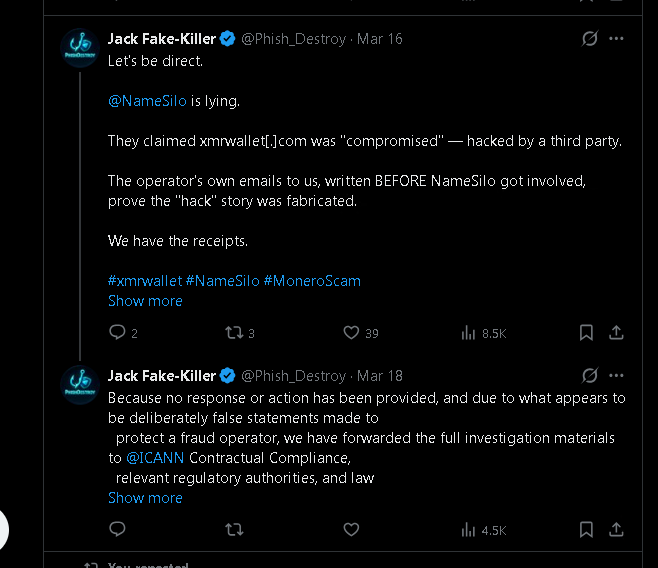
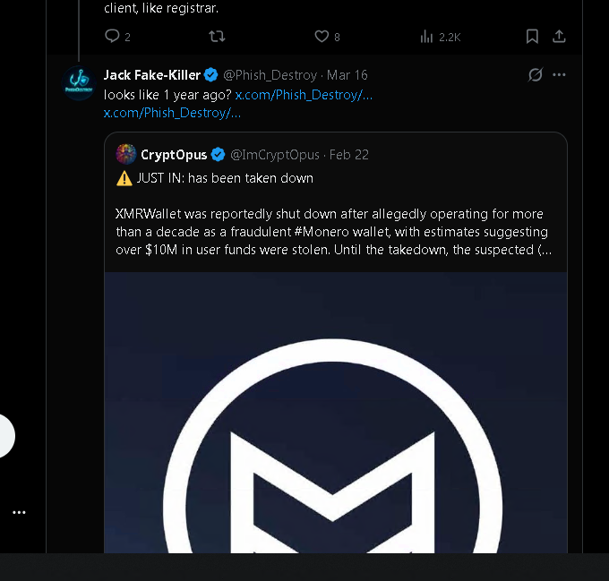
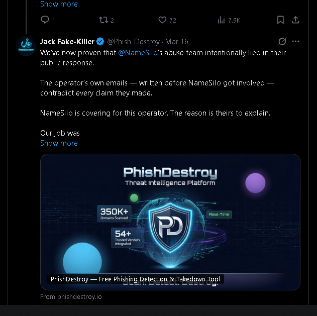

# NameSilo Lied to Defend a $20M Crypto Drainer — Then Took Down Our Twitter

*The full long-form investigation. Mirrored here so it cannot be silently taken down.*

**Mirrors of this article:** [phishdestroy.io](https://phishdestroy.io/namesilo-killed-our-twitter) · [Medium](https://phishdestroy.medium.com/namesilo-lied-to-defend-a-20m-crypto-scam-then-took-down-our-twitter-4904d15d531e) · this GitHub repo · [GitHub Pages](https://phishdestroy.github.io/namesilo-xmrwallet-coverup/)

**Compact version:** [`README.md`](README.md) · **Connection:** [`CONNECTION.md`](CONNECTION.md) · **Lies:** [`THE-LIES.md`](THE-LIES.md) · **Pressure:** [`PRESSURE.md`](PRESSURE.md) · **Evidence:** [`EVIDENCE_INDEX.md`](EVIDENCE_INDEX.md)

---

> A U.S. ICANN-accredited registrar publicly defended a 10-year Monero theft operation, offered to help the operator clean his VirusTotal record, and — once we showed every word of their statement was false — used their paid Gold Checkmark on X to lock our research account. X's own automation cleared us in writing. The lock is still there. So we're putting the story everywhere, because they don't like the truth and we do.

*By PhishDestroy Research — April 2026*

> 📎 Originally published on Medium: [phishdestroy.medium.com/namesilo-lied-to-defend-a-20m-crypto-scam-then-took-down-our-twitter](https://phishdestroy.medium.com/namesilo-lied-to-defend-a-20m-crypto-scam-then-took-down-our-twitter-4904d15d531e)

---

## The short version

A U.S. registrar called **NameSilo** publicly defended `xmrwallet[.]com` — a Monero wallet that has been quietly stealing private keys for about ten years. Estimated damage: **$10M–$20M**.

*Long live freedom of speech? Or is this about protecting scammers and lining pockets?*

Their defense was a tweet. Four sentences. We went through it sentence by sentence. Every one of them was false, and we said so, with receipts.

Three weeks later our research account on X — **@Phish_Destroy**, paid Gold Checkmark, never warned, never reported anything fake — went into permanent lockdown. X's automation reviewed the appeal and wrote back: *"no violation, restored to full functionality."* The account is still locked. The Gold subscription is still being billed. We can't even pull our own posts back out — including the tweets where we tagged NameSilo under older threads from other researchers, which is apparently the part the registrar found unforgivable.

This wasn't a one-off either. We've been sending NameSilo abuse reports on US-targeting crypto scams since 2023, and through 2024 we sent a lot of them. The pattern was always the same — silence, or a polite reply that nothing was wrong. On this case they didn't just ignore. They went public defending the operator.

And three days before NameSilo went public defending him, the scammer himself sent us one sentence about his own registrar that, alone, tells you everything you need to know about this story. We'll get to that line in Section 5.

**A small Easter egg for NameSilo:** we run on the Hydra principle. Cut down one link — five more grow back.

---

## 1. How this actually started — a GitHub Issue and a warning the scammer chose to ignore

Honest framing first, because it matters.

I wasn't running some big targeted operation against `xmrwallet[.]com`. I opened a GitHub Issue in the scammer's repo — a repo that, by the way, has nothing technically to do with the website itself, since the site sits behind DDoS-Guard. Just an Issue.

The operator wrote to `abuse@phishdestroy.io` off the back of that Issue. February 16, signed N.R., asking us — politely at first — to take the report down:

> "Hi, You are incorrect with your report. There is no phishing going on with xmrwallet.com, this is the official domain name for xmrwallet. We are an open source crypto wallet that is non-custodial, we don't store seeds or keys, everything is done in your browser locally. Please remove your report on us, thank you. N.R."

So we answered him. Same day. Calm, professional, technical, and explicit about how this would go from here:

> "Hello, Let's keep this clear and professional.
>
> Analysis of phishing schemes and wallet abuse is a specialized field, and this case has already raised multiple technical indicators that warrant attention. The observations are based on actual production behavior and are reproducible. At the moment, this is not a full audit — just a focused review driven by professional interest."

Then we walked him through the actual technical observations. Plainly:

- Client-side transaction generated but explicitly discarded (`raw_tx_and_hash.raw = 0`)
- Backend constructing its own transaction independently of the client one
- Production-only parameters — `session_key`, `verification`, encrypted payload — that don't exist in the public GitHub repository
- The `session_key` carrying the full wallet address and the private view key in base64
- A non-standard `type == 'swept'` transaction paired with "Unknown transaction id," indicating server-side initiated operations not traceable through standard tooling
- An observable divergence between his public GitHub code and the production behavior of his own site

And we told him, in writing, exactly what would happen next:

> "The current assessment stands and is technically grounded. The behavior aligns with known high-risk transaction handling patterns. Dismissing findings without addressing these mechanics does not change the conclusion.
>
> If this remains a technical discussion, it stays at this level.
>
> If it escalates — through continued denial or misrepresentation — it may justify a complete end-to-end audit with full documentation, reproducible evidence, and formal submission to relevant security and infrastructure channels.
>
> **Nothing here is based on assumptions — only on observable system behavior and verifiable logic. What happens next depends entirely on how you choose to proceed."**

Read that last line again. *"What happens next depends entirely on how you choose to proceed."* On the record, in writing, time-stamped February 16. We told him exactly what we'd do, before doing any of it.

That email is not a threat. It's a courtesy. We give it because we work hard to be transparent and accurate, and we genuinely don't want to put more time into a deeper case if there's a chance we're wrong. Any security researcher will know the reflex — false positives are the single worst thing in our line of work, and the easiest way to avoid one is to give the subject a clean exit before you commit further resources.

A person with even average self-preservation instincts would have read that email once, gone quiet, and kept running their site without ever writing to us again. That option was right there, in plain text, on February 16.

He didn't take it. He kept writing. He kept arguing. Later, when domains he liked started getting acted on by other registrars, he came back accusing us of "killing three of his domains," treating the investigation like personal harassment instead of the documented, reproducible analysis it actually was.

So we did exactly what we'd already told him we'd do. We went deeper. We documented every endpoint. We published. **Each step of that escalation was, on the record, a response to one of his.** None of it was unprovoked.

Three weeks later, his registrar — the one he wasn't afraid of — picked up exactly where he left off. Same posture. Same tone. Same wave-it-away dismissal of the work.

Two parties, scammer and registrar, both made the same mistake, and neither of them made it just once.

---

## 2. Every move we made was a response

The framing the scammer pushed, and the registrar later echoed, is that we are some kind of attack squad picking on independent operators. It's worth being clear about what actually happened, in order:

- **The investigation only escalated because the operator escalated it.** Every step on our side — the technical breakdown, the repeated abuse reports, the public thread, the formal escalation to ICANN — landed only after a fresh action from his side. Denial. Reposted lies. Attacks on other researchers. Attempts to wipe reviews and bury repos. We had told him in the first email exactly how this would go: *"What happens next depends entirely on how you choose to proceed."* He chose to proceed loudly.
- **Then NameSilo decided to make it their problem.** The smart move was silence — quietly act on the abuse report, or quietly do nothing. Instead they published a tweet declaring their abuse team had done a deep review, that the scammer was "the victim," that no abuse reports had ever been received, and that they were going to help him scrub his VirusTotal detections.

After a public statement like that, from the registrar of the domain, the responsible move on our side was not to go quiet. The responsible move was to keep the receipts visible, refuse to let the lie stand unopposed, and tag the registrar under the older threads from other researchers who had been documenting `xmrwallet` for years before us. Anything else would have been complicity.

That was apparently the conduct that tipped NameSilo into using the Gold Checkmark channel on X. **Refusing to fall silent in the face of a public lie was the "violation."** If that's the rule, then the rule is the problem.

---

## 3. Their statement, taken apart line by line

March 13, 2026. NameSilo's official account posts this under our investigation thread:

> "Our Abuse team conducted an in-depth review into this case and it seems that domain was compromised a few months ago (during which a copy of the webpage was replaced with a crypto-drainer). Prior to that, we had received no abuse reports related to this domain. After an extensive review…"

Permanently archived: [ghostarchive.org/archive/CXXZ0](https://ghostarchive.org/archive/CXXZ0)

I sat down with that tweet and went through it line by line. Four sentences. Four lies. Not "differently interpreted." Not "out of date." Not "a misunderstanding." False.

#### Claim 1: "Domain was compromised a few months ago."

The theft code *is* the website. Eight PHP endpoints, server-side key exfiltration, Base64 transmission to operator infrastructure, all sitting there for roughly a decade. Nothing was injected. The thing was built to steal from day one.

#### Claim 2: "Prior to that, we had received no abuse reports."

We've sent **20+ abuse reports** through their own portal between 2023 and 2026. We have the delivery receipts. Either their abuse team has no idea what reports they actually receive, or they know and lied anyway. Both are bad.

#### Claim 3: "After an extensive review… not involving the registrant."

The operator wrote to us himself, defending his code as his own work. He never claimed a hack. NameSilo's "review" apparently never asked him.

#### Claim 4: "Working with the registrant to remove the website from VT reports."

That isn't abuse handling. That's **helping a confirmed scammer scrub his security warnings while the drainer is still live.**

Meanwhile three other registrars looked at the exact same evidence and acted in days:

- **PublicDomainRegistry (PDR)** — suspended.
- **WebNic** — suspended.
- **NICENIC** — suspended.

NameSilo alone went on TV and called the thief "the victim." Full technical breakdown of the wallet itself: [phishdestroy.io/xmrwallet-namesilo-exposed](https://phishdestroy.io/xmrwallet-namesilo-exposed)

And take that fourth claim seriously, because it's the one people are sleeping on. A registrar's small in-house abuse team, looking at a confirmed phishing site that steals private keys, that has been live for a decade, that has been flagged by multiple authoritative security vendors — including Fortune-500-grade vendors that build the security telemetry the rest of the industry leans on — is publicly announcing that they're going to **help the registrant get those detections removed**.

That is an enormous amount of confidence for a small abuse team to walk in with. Their position is that they have looked at this case more carefully than every authoritative vendor that flagged it, and concluded everyone else is wrong. That isn't a disagreement. That's a public sneer at the entire profession — at every researcher, at every vendor, at every other registrar that already suspended.

The scammer had done exactly the same thing in his own emails — accusing us of "killing three of his domains," dismissing our findings as personal harassment instead of the documented work it is. Three weeks later his registrar published the same posture in their official voice.

After we replied with the full breakdown, the tone from NameSilo's side stopped sounding like "abuse team review" and started sounding like a company that had been caught. Two weeks later, our Twitter went down.

---

## 4. We posted the receipts. Publicly. While we still had an account.

Once their defense of the scammer was up, we replied with the only thing that matters in this work — proof.

> **March 16:** "Let's be direct. **@NameSilo is lying.** They claimed xmrwallet[.]com was 'compromised' — hacked by a third party. The operator's own emails to us, written BEFORE NameSilo got involved, prove the 'hack' story was fabricated. We have the receipts."

> **March 16, thread:** "🚨 @NameSilo is acting as press secretary for a $2M+ Monero theft operation. xmrwallet[.]com steals private keys since 2016. 6 security vendors flag it. 3 registrars suspended it. NameSilo called the scammer 'the victim' and is helping him remove @virustotal warnings."

> **March 16:** "Honest question for @NameSilo: Who is this operator to you? Employee? Contractor? Friend of support staff? Relative? Because he told us 'subpoena the registrar' like a man who already had your answer. 3 registrars suspended him. You wrote him a defense."
>
> "We've now proven that **@NameSilo's abuse team intentionally lied** in their public response. The operator's own emails — written before NameSilo got involved — contradict every claim they made. NameSilo is covering for this operator. The reason is theirs to explain."

**March 18**, formal escalation: *"Because no response or action has been provided, and due to what appears to be deliberately false statements made to protect a fraud operator, we have forwarded the full investigation materials to @ICANN Contractual Compliance, relevant regulatory authorities, and law enforcement…"*

That, near as we can tell, is what got the account locked. A researcher quoting a registrar's own emails back at them and notifying ICANN.

---

## 5. The scammer wasn't afraid of his own registrar. That's the whole story.

This is the line that should make every reader stop scrolling. From the operator, in writing, in an email to us dated **February 17, 2026** — three weeks before NameSilo went public defending him:

> "Feel free to subpoena the domain registrar for my information."

Read it again.

A guy running a ten-year crypto drainer, on $550-a-month bulletproof hosting in Belize, sitting behind Russian DDoS-Guard, just calmly invited us to subpoena his own registrar. Nobody behaves like that with a registrar that might shut them down. Nobody behaves like that unless they already know how the registrar is going to react.

Three days later, that same registrar called him "the victim" in public.

I'm going to say this plainly because I've thought about every other explanation and none of them fits:

> **The operator of `xmrwallet[.]com` is connected to someone inside NameSilo.** Staff, reseller-account holder, friend of an abuse-team person — something. The "honest mistake on a single review" version doesn't survive contact with the facts. Three other registrars looked at the same evidence and suspended in days. NameSilo wrote a press release for the guy.

---

## 6. The smoking gun: X cleared us. The lock didn't move.

Quick clarification, because most people don't know this: the **Gold Checkmark** on X is not the $8 blue thing. It's the Verified Organization tier — costs an organization real money per month, and one of its main perks is **direct access to a live human support agent at X**. Both NameSilo and PhishDestroy hold one. We bought ours assuming it'd protect us from drive-by troll reports. NameSilo, on the evidence here, used theirs to file a takedown.

We even said it would happen, before it happened. We posted on Twitter — and notarized it in [GhostArchive](https://ghostarchive.org/archive/CXXZ0) before the lock dropped — that NameSilo would try to silence us the same way the scammer silences everyone else. They did. Right on schedule. *Yeah, yeah — we knew NameSilo would do exactly what they did.*

### Email #1 — the lock

> *"Our support team has determined that a violation against inauthentic behaviors [occurred]. We will not overturn our decision."*

No tweet quoted. No specific rule cited. No example. Just a verdict. That's not what an automated rule trigger looks like. That's what a human agent decision looks like, after a complaint.

And it's worth noting *what* we were doing in the days before the lock came down. We were tagging NameSilo, in public, under **older threads from other researchers** who had documented `xmrwallet[.]com` long before us — pulling those receipts back into the timeline so the registrar's "we received no abuse reports" claim would be visible next to other people's evidence too. That, near as we can tell, is the actual conduct that broke their patience. Not insults. Not doxxing. Not anything against X's rules. Just dragging old, archived proof into the registrar's mentions and refusing to let the public statement quietly age out of view.

### Email #2 — and now they contradict themselves

Subject line, in their own words: **"[4] Your account has been restored."** Date: April 15, 2026.

> "Hello, We have reviewed your appeal request for account, @Phish_Destroy. **Our automated systems have determined there was no violation and have restored your account to full functionality.** Thanks, X Support."

### Reality check, today

- The account is **still locked**.
- The Gold subscription **is still being billed**.
- We **cannot pull down our own posts** — the very tweets that put NameSilo on the spot are now invisible to us, on our own account.
- No third email has rolled back Email #2. It just stands there, contradicting reality.

So one of two things is true:

1. Email #2 is real. The automation said "no violation, restore." A human agent then manually overrode the machine after a Gold-tier complaint came in. The human kept the lock the automation lifted.
2. Email #2 is wrong. X sent a false restoration notice and never bothered to correct it, while continuing to bill a paid subscriber for a frozen account.

Either version is the same conclusion in different words. **The Gold Checkmark "live human support" channel on X can be used by paying corporate accounts to silence whistleblowers.** NameSilo paid for priority access to X moderators, and that access produced a ban that X's own automation had already thrown out. That's not content moderation. That's concierge censorship that you can buy.

---

## 7. The same handwriting

Look at the pattern, side by side, and try not to see it.

The scammer's whole career, when caught: make the evidence go away. Fake DMCA the GitHub repo. Mass-report the Trustpilot reviewer. Get the BitcoinTalk thread buried. Spam-report the YouTube video. Find the "report abuse" button on whatever platform the critic is on, and pull it.

NameSilo, when caught lying about him: make the evidence go away. File a complaint through the Gold Checkmark channel on X. Get the research account locked. Lock the researcher out of his own posts so he can't redistribute them. Hope the audience moves on.

Same handwriting. The scammer learned to delete people who tell the truth. NameSilo just did the same thing on a corporate scale.

---

## 8. NameSilo, not NICENIC, is the worst registrar we have ever dealt with

For two years our internal worst-registrar list had **NICENIC** at the top. Slow, lazy, hosts a lot of garbage, ignores most of what you send them. We are correcting that ranking, in public, today.

> **The worst registrar PhishDestroy has ever encountered is NameSilo.**

And it is important to be precise about why, because the registrars we usually call "the bad ones" are not the real enemy in this story. Let me break it down:

- **NICENIC, WebNic, PDR, Key-Systems, ENOM, Dynadot** — the registrars with the worst reputation for abuse handling — are *slow*. They *ignore* reports. They make you send three follow-ups. They sometimes never respond at all. That is bad. It is reasonable to be angry at them. But that is the entire scope of their failure.
- **None** of those registrars has ever stood up in public and called a confirmed crypto-drainer "the victim of a hack."
- **None** of them has ever published a tweet declaring that they are going to help an active scammer get his VirusTotal detections removed.
- **None** of them has ever told the public, on the record, that they "received no abuse reports" about a domain that has been reported dozens of times through their own portal with delivery receipts to prove it.
- **None** of them, to our knowledge, has ever weaponised a paid X support channel to silence a researcher who quoted their own emails back at them.

Those registrars are messy infrastructure providers. **NameSilo turned itself into a propaganda department for a $20M fraud operation.** That is a different category of failure entirely.

To be even clearer: silence is not the same as defense. Ignoring a report is not the same as *publicly siding with the operator*. Slow processing is not the same as *actively helping the scammer scrub his security record*. Sloppy abuse handling is not the same as *lying in your official voice and then banning the witness*. NICENIC is bad at its job. NameSilo, on this case, decided to do a different job — and the job they chose was protecting the thief.

And this is not a one-domain story. In our records, NameSilo is tied to **hundreds of active crypto-scam domains targeting U.S. users**. Across two years of work, we have watched the same pattern over and over: reports submitted, reports ignored, scams kept running. Until `xmrwallet[.]com`, the worst we'd seen from NameSilo was institutional negligence. With `xmrwallet[.]com`, they crossed into something else — public defense of the operator, public help with his detections, public retaliation against the people who proved them wrong.

If a registrar that ignores reports is "bad," there is no word strong enough yet for what NameSilo has put on the record here. We are settling for "the worst registrar PhishDestroy has ever encountered." It will do for now.

---

## 9. From now on, every report is public — with timestamps and explicit consent for court use

One operational change came directly out of this case. We'd assumed, naively, that an ICANN-accredited registrar maintained an honest accounting of the abuse reports it received and acted on. NameSilo's *"prior to that, we had received no abuse reports"* — published over our 20+ delivery-receipted submissions — proved that assumption wrong. Either there's no proper intake control on their side, or there is and the public statement was knowingly false. Either reading is its own scandal.

So:

- Every abuse report we file is **also published live** on [phishdestroy.io](https://phishdestroy.io), alongside the registrar's response — or their silence.
- Each report carries a **delivery timestamp**, so the registrar's response window is publicly counted in days, not in private tickets that can later be claimed to have never arrived.
- Every report carries our **explicit, written consent for the published evidence to be used as-is in any legal, regulatory, or law-enforcement proceeding**. By victims, by prosecutors, by ICANN, by any court. No further authorization required from us. Take it, file it, attach it.

This is the direct answer to "we received no abuse reports." There's now a public ledger and a clock on the wall. If a registrar claims a report never arrived, anyone can go read the report.

---

## 10. What we're working on next: the archive and "njan la"

We're currently tracking a strangely high volume of DDoS traffic hitting `phishdestroy.io` from infrastructure tied to the **"njan la"** hosting ecosystem. We'll map that. But while we do, our primary focus is shifting to something much bigger: the historical record.

We're pulling every abuse report we filed against NameSilo-registered domains between **2022 and 2024** — the absolute peak of the crypto-drainer and pig-butchering epidemics. During that era, NameSilo's favourite reseller, **"njan la"**, was the undisputed king of bulletproof infrastructure. We're going to start asking the uncomfortable questions: how much money was made selling overpriced, abuse-tolerant domains before "njan la" quietly shut down its public API? And is "njan la" actually an independent reseller, or something much closer to a subsidiary?

NameSilo acted like missing 20 reports on a single domain was a simple discrepancy. For context: over the years our project has discovered and reported between **300,000 and 500,000 malicious domains** across the internet. Let's be clear — digging into NameSilo's history is not revenge for our Twitter ban. We expected the ban because we had thoroughly studied how their scammer operates (and notice, I'm still formally treating the operator as a separate person, even if the facts heavily suggest otherwise). All actions we take here are strictly investigative, not offensive.

We're going to publish the complete, historical archive of PhishDestroy reports sent to NameSilo. Not to brag about scale — there is nothing to be proud of as long as entities like NameSilo and its "resellers" profit from scamming ordinary people. They hide behind excuses like "freedom of speech" while charging two-to-five-times premiums for bulletproof ignorance of abuse. I'm not a lawyer, but the pattern is staggering.

Since NameSilo claims they don't receive reports — or simply lose them — **we will become their permanent, public archive**. Scammers can look at it to write NameSilo a thank-you note for ignoring so many of our complaints. Victims can look at it to realise that if this registrar had simply enforced basic ICANN rules, their life savings might still be intact. But NameSilo doesn't seem to care about that. They're too busy volunteering to scrub VirusTotal detections for the thieves.

Both the reseller analysis and the source-IP DDoS breakdown will be published on [phishdestroy.io](https://phishdestroy.io) when they're ready.

---

## 11. Why this is going up in more than one place

NameSilo doesn't like the truth. We do. So this article is going on Medium, on dev.to, on our own site, in the GitHub evidence repo, and in GhostArchive — all the places we already use to keep the case file from disappearing. There's no campaign, no petition, no "demand action." Just facts, in more than one location, with timestamps.

If you're a victim of `xmrwallet[.]com` and you need the evidence package for a report or a filing, it's permanently available at [phishdestroy.io](https://phishdestroy.io) or [report@phishdestroy.io](mailto:report@phishdestroy.io). Take whatever you need.

---

## 12. A short note to the scammer and his registrar

I understand the truth is uncomfortable for both of you. You'll find the report button without my help.

But the question stands: do you actually believe the truth about what you did can be erased?

It can't. The receipts exist. The archives exist. The screenshots exist. Every move you make to take this down only adds another timestamp to the file.

You can keep clicking. It changes nothing.

---

## Final word

We told the public, in advance, that NameSilo would try to silence us. We notarized that prediction in [GhostArchive](https://ghostarchive.org/archive/CXXZ0) before the lock dropped. They did exactly what we said they would do.

And here is the article they were trying to prevent.

> **Scammers delete evidence. NameSilo defended one. X locked our account. The archive remains. The truth remains. We remain.**

---

## Sources & permanent archives

- NameSilo's original tweet, archived: [ghostarchive.org/archive/CXXZ0](https://ghostarchive.org/archive/CXXZ0)
- Full technical investigation of `xmrwallet[.]com`: [phishdestroy.io/xmrwallet-namesilo-exposed](https://phishdestroy.io/xmrwallet-namesilo-exposed)
- How NameSilo killed our Twitter — full evidence dossier: [phishdestroy.io/namesilo-killed-our-twitter](https://phishdestroy.io/namesilo-killed-our-twitter)
- Earlier Medium write-up on the scam itself: [phishdestroy.medium.com/xmrwallet-com-2953f35b8a79](https://phishdestroy.medium.com/xmrwallet-com-2953f35b8a79)
- GitHub evidence repository: [github.com/phishdestroy/DO-NOT-USE-xmrwallet-com](https://github.com/phishdestroy/DO-NOT-USE-xmrwallet-com)
- **Originally published on Medium:** [phishdestroy.medium.com/namesilo-lied-to-defend-a-20m-crypto-scam-then-took-down-our-twitter](https://phishdestroy.medium.com/namesilo-lied-to-defend-a-20m-crypto-scam-then-took-down-our-twitter-4904d15d531e)

---

*PhishDestroy Research — [phishdestroy.io](https://phishdestroy.io)*
