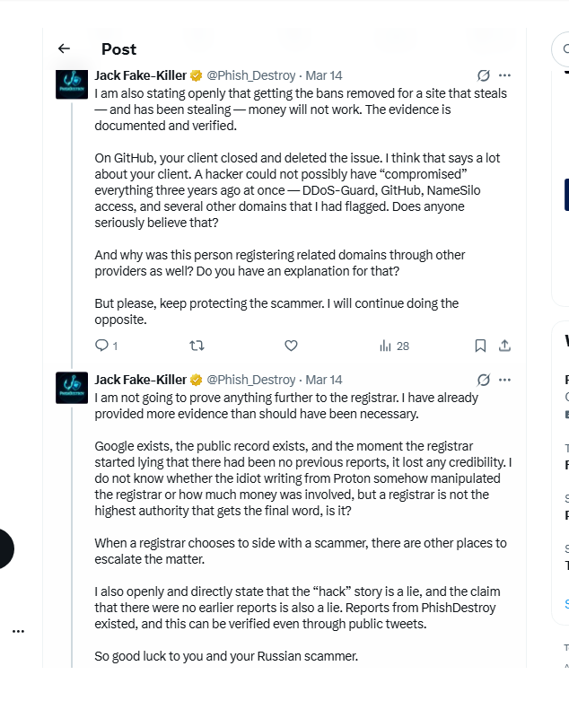
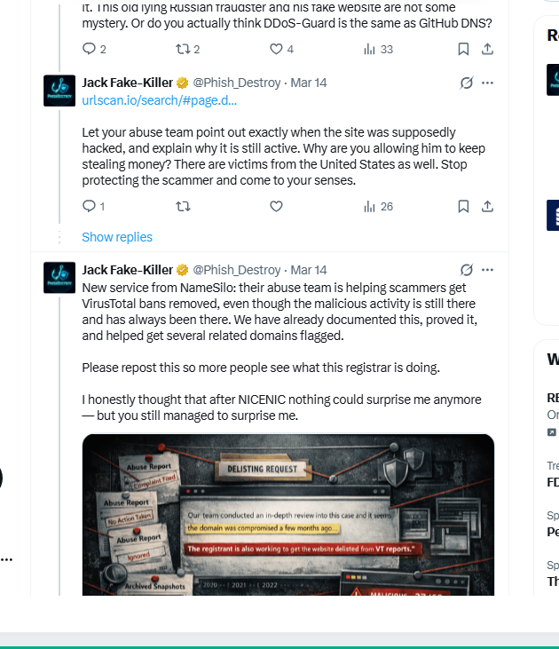

<!--
NameSilo, LLC (IANA #1479) / xmrwallet — public evidence repository
Canonical: https://phishdestroy.io/namesilo-evidence
SEO topics: namesilo, xmrwallet, monero-drainer, crypto-scam, registrar-abuse, icann-compliance, phishdestroy
-->

<div align="center">


<br/>

[](LICENSE)
[](EVIDENCE_HASHES.txt)
[](https://www.icann.org/compliance)
[](https://phishdestroy.github.io/namesilo-evidence/)

<br/>


</div>

---

## TL;DR

> We obtained the **complete zone file** of NameSilo, LLC (IANA #1479) and scanned all **5,269,357** of their active domains. No sampling. Every domain. **87.3% is garbage.** Meanwhile, NameSilo publicly defended a 10-year, $10-20M Monero drainer on Twitter, denied receiving 20+ abuse reports, and committed in writing to helping the scammer erase his VirusTotal detections. Three other registrars suspended the same domain immediately. NameSilo published a press release for him.
>
> **Their only response to this investigation: they quietly moved the scammer's domain to a different registrar. No rebuttal. No facts. No answers.**

---

## Investigation Scale

<div align="center">

| Metric | Value | Method |
|:-------|------:|:-------|
| Total NameSilo domains analyzed | **5,269,357** | Complete zone file census |
| Junk / abuse domains | **4,600,249 (87.3%)** | HTTP + content classification |
| Brand-phishing domains | **3,726** | Favicon fingerprint + content |
| Indonesian gambling (confirmed) | **19,198** | MurmurHash3 favicon clustering |
| Single server fingerprint cluster | **328,230 domains** | SHA-256(Server+XPB+ETag) |
| CF-confirmed phishing on that cluster | **2,062** | Cloudflare threat feed |
| Malicious behind PrivacyGuardian | **183,419** | RDAP + 25 threat intelligence feeds |
| Hard-confirmed malicious (3+ sources) | **109,196** | Multi-source cross-validation |
| Brand impersonations (USPS, Google...) | **201** | Content + title analysis |
| Dead domains: NameSilo vs industry avg | **32.2% vs 14-21%** | 8-registrar, 130M domain comparison |
| xmrwallet.com funds drained | **~$10M-$20M** | On-chain + victim reports |
| Years of operation | **~10 years (2016-2026)** | Domain history + archived content |
| Abuse reports submitted, ignored | **20+** delivery-receipted | Submission records |
| Other registrars that suspended | **3** (PDR, WebNic, NICENIC) | Suspension notices |

</div>

---

## Methodology

Two-pass distributed scanner — AWS Lambda + GCP Cloud Run, up to 400 concurrent workers:

```
Phase 1 — Initial scan (AWS Lambda, up to 400 concurrent)
  2,503,213 domains probed | aiohttp/asyncio | 5s timeout

Phase 2 — Rescan of missed domains (GCP Cloud Run, 20 containers x 400 async)
  894,300 additional domains probed

Merged: 3,397,413 domains with DNS -> 1,129,114 active responses
```

Classification pipeline:

```
HTTP response
  |-- Page type classifier  (active_content / parking / redirect / phishing / ...)
  |-- Favicon fingerprint   MurmurHash3 -> operator clusters
  |-- Server fingerprint    SHA-256(Server + X-Powered-By + ETag) -> 12-char hex
  |-- Parking detection     Named service patterns (namesilo / sedo / godaddy / ...)
  +-- Brand matching        Domain name + title + favicon hash -> phishing label
```

PrivacyGuardian investigation (separate pipeline):

```
NameSilo zone file (4,974,265 candidate PG domains)
  -> RDAP validation vs rdap.namesilo.com
      -> 164,027 CONFIRMED PrivacyGuardian-protected
          -> Cross-referenced: 25+ threat feeds
              -> 183,419 confirmed malicious | 109,196 hard-confirmed
```

---

## Timeline

```
2016          xmrwallet.com goes live
              session_key exfiltrated 40+ times per session to operator server

2023-2026     PhishDestroy: 20+ delivery-receipted abuse reports -> namesilo.com
              Result: zero action

Feb 16, 2026  Operator emails PhishDestroy: "There is no phishing."
              Never claims a hack. Never mentions a compromise.

Mar 12, 2026  PhishDestroy tweet: "9 reports is no joke anymore."

Mar 13, 2026  NameSilo official corporate tweet:
              [X] "Domain was compromised a few months ago"   <- FABRICATED
              [X] "No abuse reports received prior to this"   <- FALSE
              [X] "Working to get site delisted from VT"      <- OBSTRUCTION
              [X] "The registrant is also the victim"         <- FALSE

              PDR, WebNic, NICENIC: suspended the same domain in days.
              NameSilo: published a press release for the scammer.

Mar 16, 2026  PhishDestroy publishes receipts publicly.
              NameSilo uses X Gold Checkmark support to lock account.

Mar 18, 2026  Filed with ICANN Contractual Compliance.

Apr 15, 2026  X automated review: "No violation. Account restored."
              Human agent overrides. Account still locked.

May 11, 2026  NameSilo tweets legal threat. Zero factual rebuttal provided.

Jun 2026      Full zone scan complete: 5,269,357 domains, 87.3% junk.
              NameSilo response: transfers scammer domain to Namecheap.
              Site remains live.
```

---

## Interactive Reports

<div align="center">

| Report | Description | Link |
|--------|-------------|------|
| Full Investigation Report | Visual report: charts, IOC breakdown, chain of custody | [namesilo-scan.html](https://phishdestroy.github.io/namesilo-evidence/namesilo-scan.html) |
| Favicon Cluster Analysis | 12 operator clusters via MurmurHash3 fingerprinting | [namesilo-clusters.html](https://phishdestroy.github.io/namesilo-evidence/namesilo-clusters.html) |
| IOC Domain List | 107,252 criminal domains — searchable with flags and favicons | [namesilo-domains.html](https://phishdestroy.github.io/namesilo-evidence/namesilo-domains.html) |
| PrivacyGuardian Shield | 183,419 malicious domains behind NameSilo's own WHOIS privacy | [namesilo-privacyguardian.html](https://phishdestroy.github.io/namesilo-evidence/namesilo-privacyguardian.html) |
| Index | Main investigation page | [phishdestroy.github.io/namesilo-evidence](https://phishdestroy.github.io/namesilo-evidence/) |

</div>

> Raw scan data (JSONL/CSV, up to 499MB) available as gzip archives: [`pkg/raw_data/`](pkg/raw_data/)

---

## Repository Index

| Document | Contents |
|----------|----------|
| [PROOFS.md](PROOFS.md) | Master evidence index, all exhibits SHA-256 verified |
| [INVESTIGATION_DOSSIER_EN.md](INVESTIGATION_DOSSIER_EN.md) | Complete investigation dossier (613 lines) |
| [ARTICLE_FULL.md](ARTICLE_FULL.md) | Full investigative article |
| [CONNECTION.md](CONNECTION.md) | NameSilo <-> xmrwallet operator evidence chain |
| [THE-LIES.md](THE-LIES.md) | Line-by-line rebuttal of NameSilo's March 13 statement |
| [NAMESILO-RESPONSE-MAY2026.md](NAMESILO-RESPONSE-MAY2026.md) | May 11 legal threat tweet, documented and archived |
| [NAMESILO_DOMAIN_ANOMALY_REPORT.md](NAMESILO_DOMAIN_ANOMALY_REPORT.md) | Statistical analysis: 8 registrars, 130M domains |
| [PRESSURE.md](PRESSURE.md) | Suppression campaign log |
| [SCAM_TECHNICAL.md](SCAM_TECHNICAL.md) | xmrwallet technical breakdown (8 PHP endpoints) |
| [OPERATOR_PROFILE.md](OPERATOR_PROFILE.md) | Operator dossier: identity, domains, IPs, IOCs |
| [VICTIMS.md](VICTIMS.md) | Documented victims, 2016-2026 timeline |
| [SOURCES.md](SOURCES.md) | Permanent archive URLs for all external claims |

---

## Forensic Diagrams

<div align="center">

| | | |
|:-:|:-:|:-:|
| [](docs/assets/diagram-money-flow.png) | [](docs/assets/diagram-timeline.png) | [](docs/assets/diagram-theft-mechanism.png) |
| Money Flow | 10-Year Timeline | Theft Mechanism |
| [](docs/assets/diagram-operator-network.png) | [](docs/assets/diagram-suppression.png) | [](docs/assets/diagram-domain-infra.png) |
| Operator Network | Suppression Campaign | Domain Infrastructure |

</div>

---

## Verify the Evidence

```bash
git clone https://github.com/phishdestroy/namesilo-evidence.git
cd namesilo-evidence/evidence
sha256sum -c ../EVIDENCE_HASHES.txt
# All 10 files: OK
```

---

## For Victims, Regulators & Press

**Victims of xmrwallet.com:**
File at [IC3.gov](https://www.ic3.gov), [FTC](https://reportfraud.ftc.gov), or [ICANN Compliance](https://www.icann.org/compliance). Attach this repo URL.
Contact: **report@phishdestroy.io** — [open a Victim Report issue](.github/ISSUE_TEMPLATE/victim-report.yml)

**Regulators & journalists:** Full case file forwarded to ICANN March 18, 2026.
Raw data, email headers, server captures on request: **abuse@phishdestroy.io**

The [LICENSE](LICENSE) grants explicit permission to use this evidence in any legal or regulatory proceeding.

---

## Mirrors

| Platform | Link |
|----------|------|
| ENS + IPFS | [phishdestroy.eth.limo](https://phishdestroy.eth.limo/) |
| GitHub Pages | [phishdestroy.github.io/namesilo-evidence](https://phishdestroy.github.io/namesilo-evidence/) |
| Canonical | [phishdestroy.io](https://phishdestroy.io/namesilo-killed-our-twitter) |
| Codeberg | [codeberg.org/phishdestroy/namesilo-evidence](https://codeberg.org/phishdestroy/namesilo-evidence) |
| GhostArchive | [ghostarchive.org/archive/CXXZ0](https://ghostarchive.org/archive/CXXZ0) |
| Wayback | [snapshot](https://web.archive.org/web/20260508165630/https://github.com/phishdestroy/namesilo-evidence) |
| IPFS CID | `bafybeibihjlg4wdmiur2k57c6be4fkttju5kekqsyuq7kl4a3uoeg65xlq` |

---

## Exhibit A — NameSilo's lie, in their own words

This is NameSilo's official corporate tweet of **March 13, 2026** — published under our investigation thread, defending a confirmed $20M crypto drainer. Four sentences. Four lies. Permanently archived: [ghostarchive.org/archive/CXXZ0](https://ghostarchive.org/archive/CXXZ0)

<div align="center">


*NameSilo, LLC (IANA #1479) (@namesilo), replying to @Phish_Destroy — March 13, 2026. 11K views. They chose to put this in public. It stays in public.*

</div>

We confronted them **the day before** this tweet: *"9 reports is no joke anymore."* Their response was not to act on the reports — it was to publicly defend the scammer. Two days later, we called it what it was:

<div align="center">


*@Phish_Destroy, March 16, 2026 — "NameSilo, LLC (IANA #1479) is acting as press secretary for a $2M+ Monero theft operation." These tweets are now invisible because the account was locked.*

</div>

---

## Exhibit B — The operator's own email, proving NameSilo, LLC (IANA #1479) lied

The operator wrote to us **first** — February 16, 2026, from `royn5094@protonmail.com`. He defended the site as his own work. He never claimed a hack. This email alone destroys NameSilo's "domain was compromised" narrative.

<div align="center">


*The operator, in his own words: "There is no phishing going on with xmrwallet.com." He never claimed a hack. NameSilo, LLC (IANA #1479) invented the "compromise" story 25 days later.*

</div>

We replied the same day with a complete technical breakdown — 8 PHP endpoints, `session_key` exfiltration, `raw_tx_and_hash.raw = 0` — and an explicit warning:

<div align="center">


*"What happens next depends entirely on how you choose to proceed." — PhishDestroy, Feb 16. He chose to keep lying. His registrar chose to help.*

</div>

---

## Exhibit C — They silenced us. X cleared us. The lock stayed.

After we posted the receipts publicly and escalated to ICANN, our account was permanently locked. X's own automation reviewed the appeal and wrote back **in writing**:

<div align="center">

<table><tr>
<td width="50%">


</td>
<td width="50%">


</td>
</tr></table>

*X Support, April 15, 2026: "No violation. Restored to full functionality." The account is **still locked.** The Gold subscription is **still being billed.** A human agent at X — accessible via NameSilo's paid Gold Checkmark support channel — overrode the machine.*

</div>

**Concierge censorship that you can buy.** Full breakdown: [`PRESSURE.md`](PRESSURE.md)

---

## Exhibit D — The question they never answered

<div align="center">


*"Who is this operator to you?" — @Phish_Destroy, March 16. 72 likes, 7.9K views. Never answered. Then our account was locked.*

</div>

---

## Exhibit E — The GhostArchive receipts (they can't delete these)

These are from the [GhostArchive snapshot](https://ghostarchive.org/archive/CXXZ0) taken **before** they started deleting. The full tweet thread, archived March 16, 2026. NameSilo's official reply is visible. Our responses are visible. The timestamps are visible. Everything they tried to make disappear is right here.

<div align="center">


*GhostArchive — our original tweet confronting NameSilo, March 12. "9 reports is no joke anymore. Stop letting this old man scam people." Below it: NameSilo's official reply with the four lies. Archived before they could touch it.*

</div>

<div align="center">



*The full NameSilo, LLC (IANA #1479) tweet — every word. "The registrant is also working to get the website delisted from VT reports." A registrar helping a scammer erase security warnings. They said this. Out loud. 11.3K people saw it.*

</div>

## Exhibit F — The thread they killed (archived copies)

These tweets were published on @Phish_Destroy on **March 14, 2026** — two days before the account was locked. They confronted NameSilo directly, called out the lies, and documented everything. NameSilo's response was not to answer — it was to get the account locked.

<div align="center">


*@Phish_Destroy, March 14: "The 'hack' story is a lie, and the claim that there were no earlier reports is also a lie. Reports from PhishDestroy existed, and this can be verified even through public tweets. So good luck to you and your Russian scammer."*

</div>

<div align="center">



*@Phish_Destroy, March 14: "Your abuse department is a disgrace. For 10 years you have been protecting a scammer, and even now you have done absolutely nothing. What is happening here is illegal." Plus: the GitHub PR screenshot — "We believe that truth is better than your profit."*

</div>

<div align="center">


*@Phish_Destroy, March 14: "New service from NameSilo: helping scammers get VirusTotal bans removed." The infographic shows the cycle: Abuse Report filed → Complaint Filed → Abuse Report Ignored → NameSilo: "the domain was compromised" → "working to get delisted from VT." All while archived snapshots from 2021-2022 prove the malicious activity was always there.*

</div>

---

## The connection — in one paragraph

A scammer running a ten-year crypto drainer, on $550-a-month bulletproof hosting in Belize, behind Russian DDoS-Guard, wrote to us on **February 17, 2026**: *"Feel free to subpoena the domain registrar for my information."* Twenty-four days later, on **March 13, 2026**, that same registrar — **NameSilo, LLC (IANA #1479)** — published an official tweet calling him **"the victim"** of a hypothetical hack, denying our 20+ abuse reports ever arrived, and announcing a public commitment to **clean up his VirusTotal detections**. Three other registrars (PDR, WebNic, NICENIC) holding the same domain looked at the same evidence and **suspended in days**. NameSilo, LLC (IANA #1479) wrote a press release for him. **They put the connection in public themselves.** This repository is the receipts.

> Full evidence chain: [`CONNECTION.md`](CONNECTION.md)

---

## The lies — in one table

| NameSilo's claim | Reality | Verdict |
|---|---|---|
| "Domain was compromised a few months ago." | The theft code *is* the website. 8 PHP endpoints, server-side `session_key` exfiltration, `raw_tx_and_hash.raw = 0`. Built to steal from day one, ~10 years. The operator **never claimed a hack** in his own emails. | **FALSE** |
| "Prior to that, we had received no abuse reports." | **20+ delivery-receipted abuse reports** through their own portal, 2023-2026. Our tweet from **one day before** their statement says "9 reports is no joke anymore." | **FALSE** |
| "After an extensive review... not involving the registrant." | The operator wrote to **us** defending his code as his own. NameSilo, LLC (IANA #1479) adopted a "compromise" framing the operator himself never advanced. | **FALSE** |
| "Working with the registrant to remove the website from VT reports." | A registrar helping a confirmed scammer erase his security warnings from 6+ authoritative vendors. Not abuse handling. **Active obstruction of consumer-protection telemetry.** | **DAMNING** |

> Full line-by-line breakdown: [`THE-LIES.md`](THE-LIES.md)

---

## The pressure campaign — what they're still doing right now

The moment we replied with the operator's own emails, the silencing started. **They have not stopped.**

| Date | What happened | Status |
|---|---|---|
| 2026-03-13 | NameSilo, LLC (IANA #1479) publishes the four-lie defense | [Archived forever](https://ghostarchive.org/archive/CXXZ0) |
| 2026-03-16 | We post the receipts — "@NameSilo is lying" | Tweets now invisible (account locked) |
| 2026-03-18 | We escalate to ICANN + law enforcement | On record |
| 2026-03-?? | **@Phish_Destroy permanently locked** via Gold Checkmark live-support | **Still locked** |
| 2026-04-15 | X automation: *"no violation, restored"* | **Lock not lifted. Gold still billed.** |
| Ongoing | **Bing search delisting** of `phishdestroy.io` | Tracking |
| Ongoing | **DDoS** from "njan la" reseller infrastructure | Mitigated |
| 8 years | Operator: fake DMCA, mass-report reviews, delete GitHub issues, 50+ paid SEO articles to bury victims | [Documented](OPERATOR_PROFILE.md) |

> Full timeline: [`PRESSURE.md`](PRESSURE.md) &middot; Operator's 8-year suppression history: [`OPERATOR_PROFILE.md`](OPERATOR_PROFILE.md)

---

## What's in this repository

```
.
├── README.md                              ← you are here
├── PROOFS.md                              ← master evidence index, every exhibit SHA-256 verified
├── INVESTIGATION_DOSSIER_EN.md            ← complete investigation dossier (613 lines)
├── ARTICLE_FULL.md                        ← full investigative article
├── CONNECTION.md                          ← NameSilo ↔ xmrwallet operator evidence chain
├── THE-LIES.md                            ← line-by-line rebuttal of NameSilo's March 13 statement
├── NAMESILO-RESPONSE-MAY2026.md           ← NameSilo's May 11 legal threat, documented
├── NAMESILO_DOMAIN_ANOMALY_REPORT.md      ← statistical analysis: 8 registrars, 130M domains
├── PRESSURE.md                            ← suppression campaign log
├── SCAM_TECHNICAL.md                      ← xmrwallet technical breakdown (8 PHP endpoints)
├── XMRWALLET_TECHNICAL.md                 ← server-side key drainer case file
├── OPERATOR_PROFILE.md                    ← operator dossier: identity, domains, IPs, IOCs
├── VICTIMS.md                             ← documented victims, 2016–2026 timeline
├── EVIDENCE_INDEX.md                      ← every screenshot indexed with SHA-256
├── SOURCES.md                             ← permanent archive URLs for all external claims
├── EVIDENCE_HASHES.txt                    ← SHA-256 of every screenshot
├── CITATION.cff                           ← machine-readable citation for legal/academic use
├── LICENSE                                ← CC-BY-4.0, explicit grant for legal/regulatory use
├── evidence/                              ← 10 SHA-256 verified screenshots
├── tools/                                 ← archive tooling (Wayback, archive.ph)
├── xmrwallet-evidence/                    ← xmrwallet-specific evidence package
├── pkg/                                   ← zone scan evidence package (5.27M domains)
│   ├── report.html                        ← main investigation report
│   ├── clusters.html                      ← favicon cluster analysis
│   ├── domains.html                       ← 107,252 IOC domains
│   ├── evidence/                          ← JSON evidence files + manifest
│   └── raw_data/                          ← gzip scan datasets (JSONL/CSV)
└── docs/                                  ← GitHub Pages
    ├── namesilo-scan.html                 ← zone scan report
    ├── namesilo-clusters.html             ← favicon clusters
    ├── namesilo-domains.html              ← 107,252 IOC domains (searchable)
    ├── namesilo-privacyguardian.html      ← 183,419 PG-shielded malicious domains
    ├── behavioral-patterns.html           ← behavioral analysis
    ├── assets/                            ← 11 forensic diagrams (PNG)
    └── evidence/                          ← SHA-256 manifests
```

> **Where do I start?** Open [`PROOFS.md`](PROOFS.md) — every piece of evidence and every mirror in one place. That is the file to share if you only have one URL.

---

## Verify the evidence yourself

Every screenshot in `evidence/` has a SHA-256 fingerprint in [`EVIDENCE_HASHES.txt`](EVIDENCE_HASHES.txt). To check that nothing has been tampered with:

```bash
git clone https://github.com/phishdestroy/namesilo-evidence.git
cd namesilo-evidence/evidence
sha256sum -c ../EVIDENCE_HASHES.txt
```

All 10 files should report `OK`. If any fails, do not trust the modified copy — open an Issue and we will investigate.

---

## For victims of `xmrwallet[.]com`

If you have lost funds to `xmrwallet[.]com`, this repository is a **ready-made evidence package** you can attach to:

- A police report (in any jurisdiction)
- An IC3 (FBI) cybercrime complaint — https://www.ic3.gov
- A FTC complaint — https://reportfraud.ftc.gov
- An ICANN Contractual Compliance complaint against NameSilo, LLC (IANA #1479) — https://www.icann.org/compliance
- A civil claim against NameSilo, LLC (IANA #1479) and/or the operator
- A chargeback / insurance filing

The license file in this repo ([`LICENSE`](LICENSE)) is **explicit, written consent** to use this evidence as-is in any of the above. No further authorization required from PhishDestroy.

Direct contact for victims: **[report@phishdestroy.io](mailto:report@phishdestroy.io)**

> Open an Issue using the [Victim Report template](.github/ISSUE_TEMPLATE/victim-report.yml) if you want your case added to the public ledger.
>
> Documented victims and the full 2016-2026 timeline: [`VICTIMS.md`](VICTIMS.md)

---

## For ICANN compliance officers, regulators, journalists

The full case file was forwarded to **ICANN Contractual Compliance on March 18, 2026**. This repository is the public mirror of that filing, with the same screenshots, the same hashes, and the same explicit consent for republication.

If you need additional materials (raw email headers, server-side capture of the eight `xmrwallet[.]com` PHP endpoints, the 20+ historical abuse-report delivery receipts to NameSilo, LLC (IANA #1479) dating back to 2023), contact **[abuse@phishdestroy.io](mailto:abuse@phishdestroy.io)** with a subject line that identifies your role.

---

## Why this matters beyond one domain

NameSilo, LLC (IANA #1479) is tied — in our records — to **hundreds of active crypto-scam domains targeting US users**. Across two years of work we have submitted thousands of abuse reports through their portal. The pattern, consistently, is silence.

`xmrwallet[.]com` is the case where they broke their silence. They went on the record. They put a defense of a confirmed scammer in their own corporate voice, on a public channel, with an offer to help him erase his security record.

This is not a single registrar making a single review error. **This is a registrar publishing a corporate policy of protecting a specific operator** — and using paid platform-level access (X Gold Checkmark live support) to silence the people who proved them wrong.

If a registrar can do this once, in public, and walk it off — every other registrar learns the lesson.

So this case is not going to walk off.

---

## Mirrors & Permanent Copies

This story is being kept alive in multiple places, intentionally. Every link below is a separate surface that would require a separate legal action to remove. Good luck.

### IPFS — Permanent, Decentralized, No "Report" Button

- **ENS + IPFS:** [`phishdestroy.eth.limo`](https://phishdestroy.eth.limo/) — Ethereum Name Service → IPFS. No server, no host, no takedown mechanism.
- **IPFS CID:** `bafybeibihjlg4wdmiur2k57c6be4fkttju5kekqsyuq7kl4a3uoeg65xlq`
- **Evidence page:** [`phishdestroy.eth.limo/evidence.html`](https://phishdestroy.eth.limo/evidence.html) — all 16 screenshots, articles, Medium mirror, Wayback links
- **4EVERLAND hosting:** [`ipfs-archive-nsdim0vd-phishdestroy.ipfs.4everland.app`](https://ipfs-archive-nsdim0vd-phishdestroy.ipfs.4everland.app/)
- **IPFS Gateways (all serve the same CID):**
  - [`dweb.link/ipfs/bafybeibihjlg4wdmiur2k57c6be4fkttju5kekqsyuq7kl4a3uoeg65xlq`](https://dweb.link/ipfs/bafybeibihjlg4wdmiur2k57c6be4fkttju5kekqsyuq7kl4a3uoeg65xlq/)
  - [`4everland.io/ipfs/bafybeibihjlg4wdmiur2k57c6be4fkttju5kekqsyuq7kl4a3uoeg65xlq`](https://4everland.io/ipfs/bafybeibihjlg4wdmiur2k57c6be4fkttju5kekqsyuq7kl4a3uoeg65xlq/)
  - [`w3s.link/ipfs/bafybeibihjlg4wdmiur2k57c6be4fkttju5kekqsyuq7kl4a3uoeg65xlq`](https://w3s.link/ipfs/bafybeibihjlg4wdmiur2k57c6be4fkttju5kekqsyuq7kl4a3uoeg65xlq/)
  - [`nftstorage.link/ipfs/bafybeibihjlg4wdmiur2k57c6be4fkttju5kekqsyuq7kl4a3uoeg65xlq`](https://nftstorage.link/ipfs/bafybeibihjlg4wdmiur2k57c6be4fkttju5kekqsyuq7kl4a3uoeg65xlq/)
  - [`gateway.ipfs.io/ipfs/bafybeibihjlg4wdmiur2k57c6be4fkttju5kekqsyuq7kl4a3uoeg65xlq`](https://gateway.ipfs.io/ipfs/bafybeibihjlg4wdmiur2k57c6be4fkttju5kekqsyuq7kl4a3uoeg65xlq/)

### Web — Traditional Hosting

- **Canonical:** [phishdestroy.io/namesilo-killed-our-twitter](https://phishdestroy.io/namesilo-killed-our-twitter)
- **Medium:** [phishdestroy.medium.com/namesilo-lied-to-defend-a-20m-crypto-scam](https://phishdestroy.medium.com/namesilo-lied-to-defend-a-20m-crypto-scam-then-took-down-our-twitter-4904d15d531e)
- **GitHub Pages mirror:** [`docs/index.html`](docs/index.html)
- **GitHub evidence repo (this one):** the file you are reading right now
- **Codeberg mirror:** [codeberg.org/phishdestroy/namesilo-evidence](https://codeberg.org/phishdestroy/namesilo-evidence)

### Third-Party Archives (we don't control these)

- **GhostArchive (NameSilo's tweet):** [ghostarchive.org/archive/CXXZ0](https://ghostarchive.org/archive/CXXZ0)
- **Wayback — PhishDestroy GitHub:** [web.archive.org snapshot](https://web.archive.org/web/20260508165746/https://github.com/phishdestroy)
- **Wayback — This repo:** [web.archive.org snapshot](https://web.archive.org/web/20260508165630/https://github.com/phishdestroy/namesilo-evidence)
- **Wayback — xmrwallet.com (live scam):** [web.archive.org snapshot](https://web.archive.org/web/20260411223411/https://www.xmrwallet.com/)
- **Wayback — xmrwallet.cc (clone, taken down):** [web.archive.org snapshot](https://web.archive.org/web/20260223024911/https://www.xmrwallet.cc/)
- **Wayback — xmrwallet.biz (clone, taken down):** [web.archive.org snapshot](https://web.archive.org/web/20260220194352/https://www.xmrwallet.biz/)
- **Wayback — xmrwallet.me (clone, taken down):** [web.archive.org snapshot](https://web.archive.org/web/20260312042503/https://www.xmrwallet.me/)
- **Wayback — xmrwallet investigation:** [web.archive.org snapshot](https://web.archive.org/web/20260508085233/https://github.com/phishdestroy/DO-NOT-USE-xmrwallet-com)
- **Wayback — xmrwallet GitHub Pages:** [web.archive.org snapshot](https://web.archive.org/web/20260508085233/https://phishdestroy.github.io/DO-NOT-USE-xmrwallet-com/)

> Cut down one link. Five more grow back. We run on the **Hydra principle**.

---

<div align="center">

### *Scammers delete evidence. NameSilo, LLC (IANA #1479) defended one. X locked our account. Bing is delisting us. The archive remains. The truth remains. We remain.*

**PhishDestroy Research** · [phishdestroy.io](https://phishdestroy.io) · [abuse@phishdestroy.io](mailto:abuse@phishdestroy.io)

</div>
