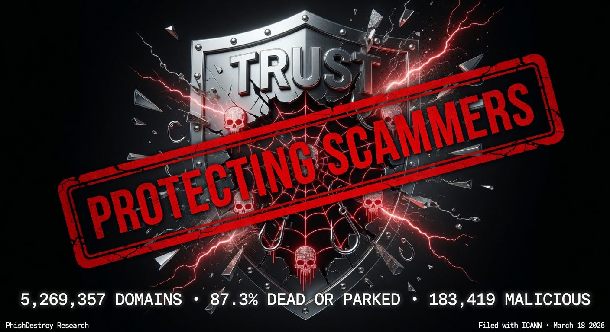

<!--
NameSilo, LLC (IANA #1479) — Registrar Abuse Investigation
Keywords: namesilo, xmrwallet, monero-drainer, crypto-scam, registrar-abuse, icann-compliance, phishdestroy
-->

<div align="center">


<br/>



<br/>

---

<h3 align="center">You made this investigation necessary.<br/>Now you cannot make it disappear.</h3>

<p align="center">
<b>NameSilo (NASDAQ: URL)</b> — a publicly traded registrar with a 32.2% dead domain rate,<br/>
a ten-year fraud under active protection, and a documented pattern of suppressing<br/>
the researchers who exposed it.<br/><br/>
Every takedown. Every lawyer. Every deleted tweet.<br/>
All of it is in the record. All of it makes this louder.<br/><br/>
<b>PhishDestroy is a Hydra. You already pulled the first head.</b>
</p>

---

[](https://phishdestroy.eth.limo/)
[](https://phishdestroy.github.io/namesilo-evidence/)
[](https://www.icann.org/compliance)
[](LICENSE)

<br/>


</div>

---

## Why NameSilo Earned This Investigation

> *They didn't end up here because we were looking for them.*
> *They ended up here because they came looking for us.*

This investigation began not with a zone file, but with a threat.

When PhishDestroy started publishing evidence about **xmrwallet[.]com** — two parties decided the correct response was intimidation. The operator arrived with lawyers and a private detective. NameSilo arrived with platform suppression and a defamation claim on Twitter.

Every attempt was documented. Every attempt failed. Every attempt is now part of the public record.

---

### Two Tracks. Same Goal. Zero Results.

<table>
<tr>
<th width="50%">🔴 xmrwallet operator</th>
<th width="50%">🔴 NameSilo, LLC (IANA #1479)</th>
</tr>
<tr>
<td>

**① Direct contact · Feb 16, 2026**

Contacted PhishDestroy researchers personally. Did not claim the site was hacked. Defended the operation as his own work. Demanded removal of all abuse reports.

*We published his email instead.*

</td>
<td>

**① Public defense · Mar 13, 2026**

Official corporate account called the operator *"the victim"*, denied receiving 20+ abuse reports, and committed in writing to helping him remove his VirusTotal detections.

*We rebutted every sentence using his own emails.*

</td>
</tr>
<tr>
<td>

**② Lawyer threats**

Threatened a lawsuit. Demanded full retraction under legal pressure.

*Threat documented and published.*

</td>
<td>

**② @Phish_Destroy locked via X Gold**

Used X Gold Checkmark live-support access to lock the research account after our rebuttal reached 11,300+ views.

*X cleared the account in writing on Apr 15: "no violation found." Lock remains. Abuse documented.*

</td>
</tr>
<tr>
<td>

**③ Private detective threat**

Claimed to have hired an investigator to identify and expose individual researchers by name.

*Documented. Researchers unidentified. Investigation continued.*

</td>
<td>

**③ "Defamation" claim · May 11, 2026**

Posted publicly on Twitter that our reporting constituted defamation. Threatened legal consequences if we did not stop.

*The reporting is factual. Every claim is sourced. Threat logged in [`NAMESILO-RESPONSE-MAY2026.md`](case/NAMESILO-RESPONSE-MAY2026.md).*

</td>
</tr>
<tr>
<td>

**④ "Serious consequences"**

Escalating personal warnings directed at individual community members.

*Archived. Ignored. Published.*

</td>
<td>

**④ 108,000 pages deindexed from Bing**

IOC reports, evidence pages, and domain analysis scrubbed from Microsoft Bing search results.

*Content mirrored to IPFS, Arweave, Codeberg, GitHub simultaneously.*

</td>
</tr>
<tr>
<td></td>
<td>

**⑤ DMCA takedown · Google**

Formal copyright claim submitted targeting research pages in Google Search. Content is factual documentation of fraud. No copyrightable material belonging to any complainant.

*Logged in Lumen Database. Strengthened the legal record.*

</td>
</tr>
</table>

---

### What Every Attempt Accomplished

| Action | By | Result |
|:-------|:---|:-------|
| Demanded report removal | Operator | Email published as evidence |
| Lawyer threats | Operator | Threat documented and published |
| Private detective threat | Operator | Documented · researchers unidentified |
| "Serious consequences" | Operator | Archived · investigation continued |
| Called operator "the victim" | NameSilo | Rebutted line-by-line · archived permanently |
| Locked @Phish_Destroy via X Gold | NameSilo | X cleared account in writing · abuse documented |
| Called reporting "defamation" | NameSilo | Logged · factual record unchanged |
| 108,000 Bing pages removed | NameSilo | Mirrored to 5+ platforms · IPFS permanent |
| DMCA filed with Google | NameSilo | Logged in Lumen · strengthened legal record |

---

> They wanted legal consequences for us.
>
> **We want legal consequences for them.**
>
> The difference is that we have the evidence.

The investigation is MIT-licensed. It lives on the blockchain. It has been filed with ICANN and submitted to IC3. There is no version of this story that ends with the evidence gone.

Every deletion attempt is itself evidence. Every threat goes into the dossier. Every escalation increases the footprint of this case.

---

## What Happened

**NameSilo, LLC (IANA #1479)** — US-based, ICANN-accredited, CSE-listed registrar (ticker: URL) — publicly defended **xmrwallet[.]com**, a Monero wallet drainer operating continuously since ~2016, with estimated victim losses of **$10–20M**.

PhishDestroy submitted 20+ delivery-receipted abuse reports over three years. NameSilo took no action. On **March 13, 2026**, their official corporate account published a statement calling the operator "the victim," denying all reports ever arrived, and committing in writing to helping him **remove his VirusTotal detections**. Three other registrars (PDR, WebNic, NICENIC) reviewed the same evidence and suspended the domain within days. NameSilo wrote a press release for him.

When we proved every sentence false using the operator's own emails, NameSilo used X Gold Checkmark live-support access to lock the @Phish_Destroy research account. X's automated review cleared it in writing on April 15, 2026. The lock is still in place.

**NameSilo's only documented response to this investigation: the scammer's domain was quietly transferred to Namecheap.**

<div align="center">


*NameSilo, LLC (IANA #1479) · March 13, 2026 · 11,300 views · [Archived](https://ghostarchive.org/archive/CXXZ0)*

</div>

---

## What We Verified

<div align="center">

| What | How | Result |
|:-----|:----|-------:|
| **Every NameSilo domain** | Complete zone file — 5,269,357 entries, zero sampling | ✓ Full census |
| **HTTP response per domain** | aiohttp/asyncio · 5s timeout · AWS Lambda 400× + GCP Cloud Run 20×400 | 1,129,114 active |
| **Page content classification** | active / parking / redirect / phishing / gambling / empty | 87.3% junk |
| **Operator identity via favicon** | MurmurHash3 on favicon bytes · identical hash = same operator | 12 clusters found |
| **Server infrastructure fingerprint** | SHA-256(Server header + X-Powered-By + ETag) → 12-char hex | 328,230-domain cluster |
| **Brand impersonation** | Domain name + page title + favicon hash → known brand list | 3,726 phishing / 201 brand impersonations |
| **PrivacyGuardian domains** | RDAP validation against rdap.namesilo.com · 4,974,265 candidates | 164,027 confirmed PG-shielded |
| **Threat feed cross-check** | 25+ independent feeds: Spamhaus DBL, SURBL, PhishTank, URLhaus, ThreatFox… | 183,419 malicious / 109,196 hard (3+ sources) |
| **Dead domain rate** | Compared against 7 other registrars · 130M total domains | 32.2% vs 14–21% baseline |
| **Trustpilot reviews** | Wayback Machine snapshots vs. live scrape · Jan 2026 → May 2026 | 129 reviews deleted |
| **PR Newswire connection** | Both xmrwallet and NameSilo used Cision/PR Newswire · verified dates | Same-day publish Jan 21–22, 2026 |
| **Abuse report receipts** | Delivery-confirmed submissions through NameSilo's own portal | 20+ reports · 0 action |

</div>

> Full scan pipeline and raw data: [`pkg/raw_data/`](pkg/raw_data/) — gzip archives, up to 499 MB uncompressed

---

## Investigation Scale

<div align="center">

| Metric | Value |
|:-------|------:|
| Total domains scanned | **5,269,357** |
| Dead / no DNS / parked (junk rate) | **4,600,249 · 87.3%** |
| Brand-phishing domains | **3,726** |
| Gambling cluster (MurmurHash3) | **19,198** |
| Single server fingerprint cluster | **328,230 domains** |
| CF-confirmed phishing on cluster | **2,062** |
| Malicious behind PrivacyGuardian | **183,419** |
| Hard-confirmed (3+ sources) | **109,196** |
| Brand impersonations | **201** |
| Dead rate vs. industry | **32.2% vs 14–21%** |
| xmrwallet victim losses | **$10M–$20M** |
| Abuse reports filed, ignored | **20+** |
| Registrars that suspended | **3 of 4** |

</div>

---

## Links by Content

### 🌐 Live Reports — [phishdestroy.github.io/namesilo-evidence](https://phishdestroy.github.io/namesilo-evidence/)

| Report | What's inside |
|:-------|:-------------|
| [Zone Scan Report](https://phishdestroy.github.io/namesilo-evidence/namesilo-scan.html) | Charts, IOC breakdown, methodology, chain of custody |
| [Favicon Cluster Analysis](https://phishdestroy.github.io/namesilo-evidence/namesilo-clusters.html) | 12 operator clusters identified via MurmurHash3 |
| [107k IOC Domain List](https://phishdestroy.github.io/namesilo-evidence/namesilo-domains.html) | Searchable table — flags, favicons, categories |
| [PrivacyGuardian Shield](https://phishdestroy.github.io/namesilo-evidence/namesilo-privacyguardian.html) | 183,419 malicious domains behind NameSilo's own WHOIS privacy |
| [Review Manipulation](https://phishdestroy.github.io/namesilo-evidence/namesilo-reviews.html) | 129 deleted Trustpilot reviews · bot network · PR Newswire link |

### 📁 Case Documents — [`case/`](case/)

| File | Contents |
|:-----|:---------|
| [INVESTIGATION_DOSSIER_EN.md](case/INVESTIGATION_DOSSIER_EN.md) | Complete investigation dossier · 613 lines |
| [ARTICLE_FULL.md](case/ARTICLE_FULL.md) | Full investigative article |
| [CONNECTION.md](case/CONNECTION.md) | NameSilo ↔ operator evidence chain |
| [THE-LIES.md](case/THE-LIES.md) | NameSilo's Mar 13 statement rebutted, line by line |
| [NAMESILO-RESPONSE-MAY2026.md](case/NAMESILO-RESPONSE-MAY2026.md) | May 11 legal threat tweet, documented |
| [NAMESILO_DOMAIN_ANOMALY_REPORT.md](case/NAMESILO_DOMAIN_ANOMALY_REPORT.md) | 8-registrar, 130M domain statistical analysis |
| [PRESSURE.md](case/PRESSURE.md) | DMCA · DDoS · account suppression campaign log |

### 🔍 Operator Intelligence — [`intel/`](intel/)

| File | Contents |
|:-----|:---------|
| [OPERATOR_PROFILE.md](intel/OPERATOR_PROFILE.md) | Identity, domains, IPs, IOCs |
| [VICTIMS.md](intel/VICTIMS.md) | Documented victims · 2016–2026 timeline |
| [SCAM_TECHNICAL.md](intel/SCAM_TECHNICAL.md) | xmrwallet: 8 PHP endpoints · session_key exfiltration |
| [XMRWALLET_TECHNICAL.md](intel/XMRWALLET_TECHNICAL.md) | Server-side key drainer case file |

### 📸 Evidence — [`evidence/`](evidence/)

16 SHA-256-verified screenshots · full index: [case/EVIDENCE_INDEX.md](case/EVIDENCE_INDEX.md)

| Key exhibit | File |
|:------------|:-----|
| NameSilo four-lie tweet (Mar 13, 2026) | [03-namesilo-statement-mar13.png](evidence/03-namesilo-statement-mar13.png) |
| Operator email — "no phishing" (Feb 16, 2026) | [01-operator-email-feb16.png](evidence/01-operator-email-feb16.png) |
| X Support — "no violation, restored" (Apr 15, 2026) | [06-x-support-no-violation.png](evidence/06-x-support-no-violation.png) |

Verify integrity:
```bash
git clone https://github.com/phishdestroy/namesilo-evidence.git
cd namesilo-evidence/evidence && sha256sum -c ../EVIDENCE_HASHES.txt
```

### 📦 Raw Scan Data — [`pkg/raw_data/`](pkg/raw_data/)

Gzip-compressed archives (all files under 60 MB):

| File | Contents | Size |
|:-----|:---------|-----:|
| `1479_full.csv.gz` | Complete 5.27M domain zone file | 54 MB |
| `domains_to_scan.jsonl.gz` | Scan input with metadata | 40 MB |
| `final_garbage.jsonl.gz` | Classified garbage/junk domains | 46 MB |
| `report_data_cache_v2.json.gz` | Full scan results cache | 30 MB |
| `all_missing_results.jsonl.gz` | Phase-2 rescan results | 26 MB |

---

## Forensic Diagrams

<div align="center">

| | | |
|:-:|:-:|:-:|
| [](docs/assets/diagram-money-flow.png) | [](docs/assets/diagram-timeline.png) | [](docs/assets/diagram-theft-mechanism.png) |
| Money Flow | 10-Year Timeline | Theft Mechanism |
| [](docs/assets/diagram-operator-network.png) | [](docs/assets/diagram-suppression.png) | [](docs/assets/diagram-domain-infra.png) |
| Operator Network | Suppression Campaign | Domain Infrastructure |

</div>

---

## NameSilo vs. The Facts

| NameSilo's Statement · Mar 13, 2026 | Reality | |
|:---|:---|:---:|
| "Domain was compromised a few months ago." | Exfiltration code *is* the site — 8 PHP endpoints, `session_key` server-side capture, `raw_tx_and_hash.raw=0`. Operator's own Feb 16 email: no hack claim. | **FALSE** |
| "No abuse reports received prior to this." | 20+ delivery-receipted reports 2023–2026. Our public tweet the day before: "9 reports is no joke anymore." | **FALSE** |
| "The registrant is also the victim." | Operator contacted PhishDestroy Feb 16, defending the site as his own work. | **FALSE** |
| "Working with registrant to remove from VT." | Published on their own corporate account. Registrar helping fraud operator erase consumer-protection alerts. | **DOCUMENTED** |

---

## Mirrors

| | Platform | Link |
|:-:|:---------|:-----|
| 🔴 | **Live investigation (IPFS + ENS)** | [phishdestroy.eth.limo](https://phishdestroy.eth.limo/) |
| ⬛ | **GitHub Pages** | [phishdestroy.github.io/namesilo-evidence](https://phishdestroy.github.io/namesilo-evidence/) |
| 🟣 | **Arweave (permanent blockchain)** | [arweave.net/LUuditolJS…](https://arweave.net/LUuditolJS-Y15IezfpzRI36sxhd1CIvFNOf_eAG2AU) |
| ⬜ | Codeberg | [codeberg.org/phishdestroy](https://codeberg.org/phishdestroy/namesilo-evidence) |
| ⬜ | Medium | [phishdestroy.medium.com](https://phishdestroy.medium.com/namesilo-lied-to-defend-a-20m-crypto-scam-then-took-down-our-twitter-4904d15d531e) |
| ⬜ | GhostArchive | [ghostarchive.org/archive/CXXZ0](https://ghostarchive.org/archive/CXXZ0) |
| ⬜ | Wayback | [snapshot](https://web.archive.org/web/20260508165630/https://github.com/phishdestroy/namesilo-evidence) |
| 📦 | IPFS CID | `bafybeibihjlg4wdmiur2k57c6be4fkttju5kekqsyuq7kl4a3uoeg65xlq` |

---

## For Victims & Regulators

**Victims of xmrwallet[.]com** — attach this repository URL to:
[IC3.gov (FBI)](https://www.ic3.gov) · [FTC](https://reportfraud.ftc.gov) · [ICANN Compliance](https://www.icann.org/compliance) · police reports · civil claims

The [MIT License](LICENSE) grants explicit permission to use this evidence in any legal or regulatory proceeding without further authorization.

**[report@phishdestroy.io](mailto:report@phishdestroy.io)** (victims) · **[abuse@phishdestroy.io](mailto:abuse@phishdestroy.io)** (regulators / press)

---

<div align="center">

**PhishDestroy Research**

[phishdestroy.eth.limo](https://phishdestroy.eth.limo/) &nbsp;·&nbsp; [phishdestroy.github.io/namesilo-evidence](https://phishdestroy.github.io/namesilo-evidence/) &nbsp;·&nbsp; [abuse@phishdestroy.io](mailto:abuse@phishdestroy.io)

*TLP:CLEAR &nbsp;·&nbsp; MIT License &nbsp;·&nbsp; Evidence chain maintained from first report, 2023, to present.*

</div>
