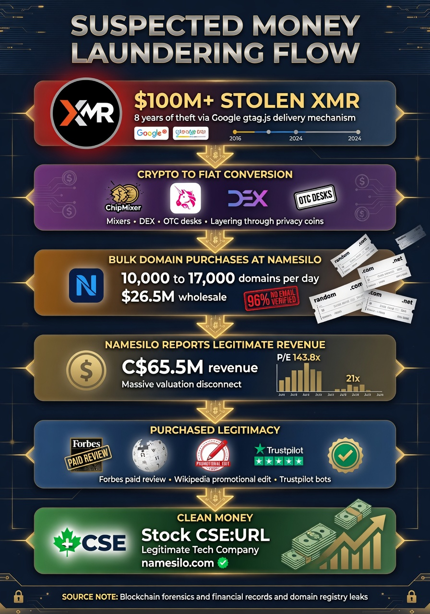
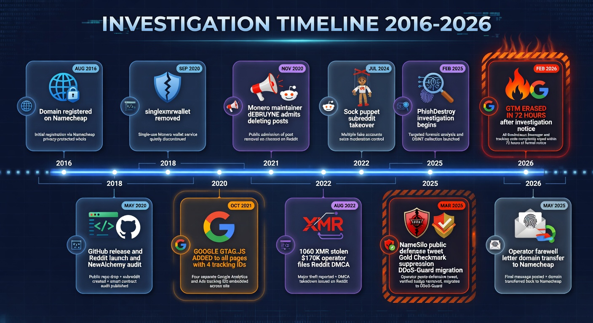
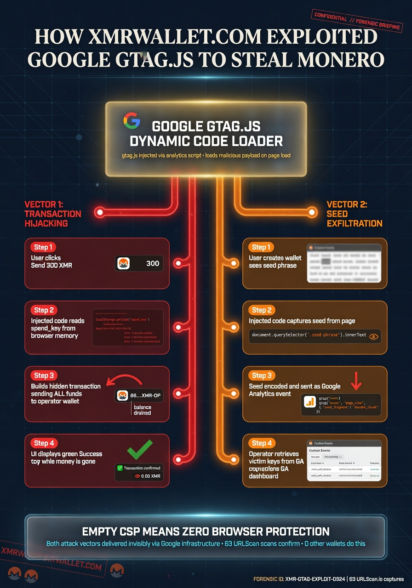
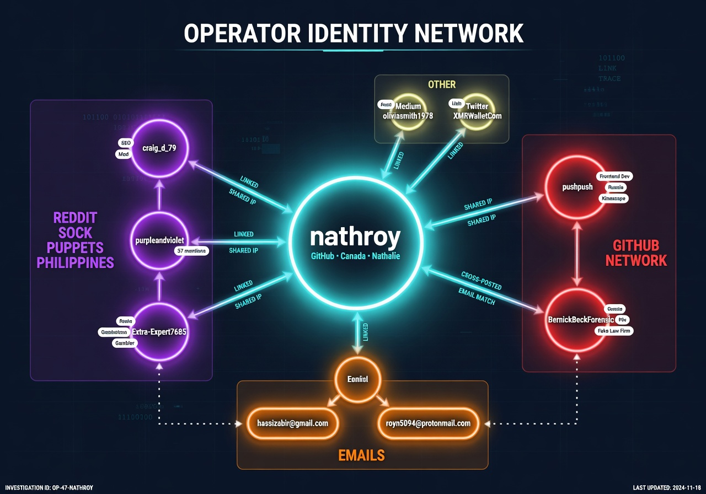
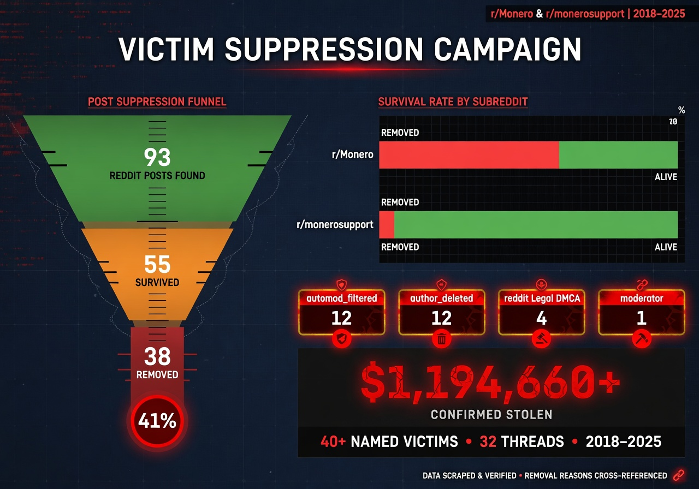
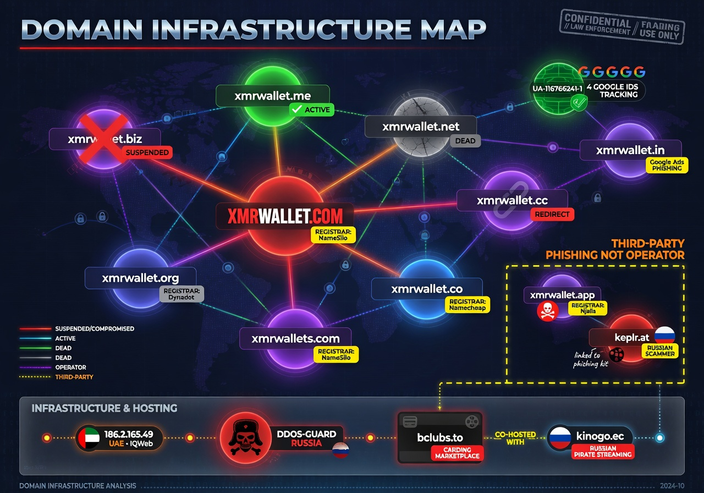

<!--
NameSilo, LLC (IANA #1479) — Registrar Abuse Investigation
Keywords: namesilo, xmrwallet, monero-drainer, crypto-scam, registrar-abuse, icann-compliance, phishdestroy
-->

<div align="center">


<br/><br/>

[](https://phishdestroy.eth.limo/)
[](https://phishdestroy.github.io/namesilo-evidence/)
[](https://www.icann.org/compliance)
[](LICENSE)

<br/>


</div>

---

## What Happened

**NameSilo, LLC (IANA #1479)** — US-based, ICANN-accredited, CSE-listed registrar (ticker: URL) — publicly defended **xmrwallet[.]com**, a Monero wallet drainer active since ~2016, estimated victim losses **$10–20M**.

We submitted 20+ delivery-receipted abuse reports. NameSilo took no action. On **March 13, 2026**, their official corporate account published a statement calling the operator "the victim," denying all abuse reports ever arrived, and committing in writing to helping him **remove his VirusTotal detections**. Three other registrars (PDR, WebNic, NICENIC) suspended the domain on review. NameSilo published a press release for him.

When we proved every sentence false using the operator's own emails, NameSilo used their X Gold Checkmark live-support access to lock our research account. X's own automated review cleared us in writing on April 15, 2026. The lock is still in place.

**Their only documented response to this investigation: the scammer's domain was quietly transferred to Namecheap.**

<div align="center">


*NameSilo, LLC (IANA #1479) — March 13, 2026 · 11,300 views · [Archived forever](https://ghostarchive.org/archive/CXXZ0)*

</div>

---

## Investigation Scale

<div align="center">

| Metric | Value | Method |
|:-------|------:|:-------|
| Total NameSilo domains scanned | **5,269,357** | Complete zone file — no sampling |
| Domains with no legitimate use | **4,600,249 (87.3%)** | HTTP + content classification |
| Brand-phishing domains | **3,726** | Favicon MurmurHash3 + content |
| Indonesian gambling cluster | **19,198** | MurmurHash3 operator fingerprint |
| Single server fingerprint cluster | **328,230** | SHA-256(Server+XPB+ETag) |
| CF-confirmed phishing on that cluster | **2,062** | Cloudflare threat feed |
| Malicious behind PrivacyGuardian | **183,419** | RDAP + 25 threat intelligence feeds |
| Hard-confirmed malicious (3+ sources) | **109,196** | Multi-source cross-validation |
| Brand impersonations (USPS, Google…) | **201** | Content + title analysis |
| Dead domains vs. industry average | **32.2% vs 14–21%** | 8-registrar, 130M domain comparison |
| Trustpilot reviews deleted (4 months) | **129** | Wayback Machine vs. live scrape |
| xmrwallet estimated victim losses | **$10M–$20M** | On-chain + victim reports |
| Abuse reports submitted, ignored | **20+** delivery-receipted | Submission records |
| Other registrars that suspended | **3** (PDR, WebNic, NICENIC) | Suspension notices |

</div>

---

## Interactive Reports

<div align="center">

| Report | Contents | Link |
|:-------|:---------|:-----|
| Zone Scan Report | Charts, IOC breakdown, methodology, chain of custody | [namesilo-scan.html](https://phishdestroy.github.io/namesilo-evidence/namesilo-scan.html) |
| Favicon Cluster Analysis | 12 operator clusters via MurmurHash3 | [namesilo-clusters.html](https://phishdestroy.github.io/namesilo-evidence/namesilo-clusters.html) |
| IOC Domain List | 107,252 criminal domains — searchable, flags, favicons | [namesilo-domains.html](https://phishdestroy.github.io/namesilo-evidence/namesilo-domains.html) |
| PrivacyGuardian Shield | 183,419 malicious domains behind NameSilo's WHOIS privacy | [namesilo-privacyguardian.html](https://phishdestroy.github.io/namesilo-evidence/namesilo-privacyguardian.html) |
| Review Manipulation | 129 deleted Trustpilot reviews · bot network · PR Newswire link | [namesilo-reviews.html](https://phishdestroy.github.io/namesilo-evidence/namesilo-reviews.html) |
| Investigation Index | Main portal | [phishdestroy.github.io/namesilo-evidence](https://phishdestroy.github.io/namesilo-evidence/) |

</div>

> Raw scan data (JSONL/CSV, up to 499 MB): [`pkg/raw_data/`](pkg/raw_data/)

---

## Repository Map

```
namesilo-evidence/
│
├── README.md                              ← you are here
├── PROOFS.md                              ← master evidence index (start here)
├── EVIDENCE_HASHES.txt                    ← SHA-256 of all evidence files
├── LICENSE                                ← CC-BY-4.0, explicit legal/regulatory grant
├── CITATION.cff                           ← machine-readable citation
│
├── case/                                  ← investigation documents
│   ├── INVESTIGATION_DOSSIER_EN.md        Full dossier (613 lines)
│   ├── ARTICLE_FULL.md                    Full investigative article
│   ├── CONNECTION.md                      NameSilo ↔ operator evidence chain
│   ├── THE-LIES.md                        NameSilo Mar 13 statement, rebutted
│   ├── NAMESILO-RESPONSE-MAY2026.md       May 11 legal threat tweet, documented
│   ├── NAMESILO_DOMAIN_ANOMALY_REPORT.md  8-registrar, 130M domain analysis
│   ├── PRESSURE.md                        DMCA · DDoS · account suppression log
│   └── SOURCES.md                         Permanent archive URLs for all claims
│
├── intel/                                 ← operator & victim intelligence
│   ├── OPERATOR_PROFILE.md               Identity, domains, IPs, IOCs
│   ├── VICTIMS.md                         Documented victims 2016–2026
│   ├── SCAM_TECHNICAL.md                  xmrwallet: 8 PHP endpoints, key exfiltration
│   └── XMRWALLET_TECHNICAL.md            Server-side key drainer case file
│
├── evidence/                              ← 16 SHA-256-verified screenshots
│   ├── 01-operator-email-feb16.png        Operator email: "no phishing" (Feb 16)
│   ├── 03-namesilo-statement-mar13.png    NameSilo four-lie tweet (Mar 13)
│   ├── 06-x-support-no-violation.png      X Support: "no violation, restored"
│   └── ...                               → full list in case/EVIDENCE_INDEX.md
│
├── docs/                                  ← phishdestroy.github.io/namesilo-evidence/
│   ├── index.html                         Investigation portal
│   ├── namesilo-scan.html                 Zone scan report
│   ├── namesilo-clusters.html             Favicon cluster analysis
│   ├── namesilo-domains.html              107k IOC domains (searchable)
│   ├── namesilo-privacyguardian.html      183k malicious PG-shielded domains
│   ├── namesilo-reviews.html              Trustpilot deletion + PR Newswire
│   └── assets/                            11 forensic diagrams (PNG)
│
├── pkg/                                   ← zone scan evidence package
│   ├── report.html / clusters.html        Source HTML reports
│   ├── evidence/                          JSON evidence files + manifest
│   └── raw_data/                          Gzip scan archives (JSONL/CSV)
│
├── xmrwallet-evidence/                    ← xmrwallet-specific evidence package
│   ├── proof/ · screenshots/ · technical/
│   └── LOST_FUNDS.md
│
├── scripts/                               ← report build scripts
│   ├── build_pg.py                        Builds namesilo-privacyguardian.html
│   └── build_reviews.py                   Builds namesilo-reviews.html
│
└── tools/                                 ← archival tooling (Wayback, IPFS, Arweave)
```

---

## Forensic Diagrams

<div align="center">

| | | |
|:-:|:-:|:-:|
| [](docs/assets/diagram-money-flow.png) | [](docs/assets/diagram-timeline.png) | [](docs/assets/diagram-theft-mechanism.png) |
| Money Flow | 10-Year Timeline | Theft Mechanism |
| [](docs/assets/diagram-operator-network.png) | [](docs/assets/diagram-suppression.png) | [](docs/assets/diagram-domain-infra.png) |
| Operator Network | Suppression Campaign | Domain Infrastructure |

</div>

---

## Methodology (Brief)

```
SCAN  →  5,269,357 domains  →  AWS Lambda 400× + GCP Cloud Run 20×400 async
          MurmurHash3 favicon fingerprint  →  operator clusters
          SHA-256(Server+XPB+ETag)         →  server fingerprint clusters
          Brand match: domain + title + favicon hash

PG    →  4,974,265 PG candidates  →  RDAP validation  →  25+ threat feeds
          183,419 malicious  |  109,196 hard-confirmed (3+ sources)

TIMELINE:  2016 → 2026  |  10 years  |  $10–20M  |  20+ reports  |  0 action
```

---

## Key Findings vs. NameSilo's Claims

| NameSilo's Statement (Mar 13, 2026) | Reality | |
|:---|:---|:---:|
| "Domain was compromised a few months ago." | Theft code is the product. 8 PHP endpoints, `session_key` exfiltration, `raw_tx_and_hash.raw=0`. Operator's own email (Feb 16): no hack mentioned. | **FALSE** |
| "No abuse reports received prior to this." | 20+ delivery-receipted reports, 2023–2026. Our public tweet the day before: "9 reports is no joke anymore." | **FALSE** |
| "The registrant is also the victim." | Operator contacted us on Feb 16 defending the site as his own work. | **FALSE** |
| "Working to remove website from VT reports." | Said publicly. A registrar helping an active fraud operator erase consumer-protection security alerts. | **DOCUMENTED** |

> Details: [`THE-LIES.md`](case/THE-LIES.md) · [`CONNECTION.md`](case/CONNECTION.md) · [`PROOFS.md`](PROOFS.md)

---

## Verify Evidence

```bash
git clone https://github.com/phishdestroy/namesilo-evidence.git
cd namesilo-evidence/evidence && sha256sum -c ../EVIDENCE_HASHES.txt
# All files: OK
```

Full manifest with timestamps: [`pkg/evidence/evidence_manifest.json`](pkg/evidence/evidence_manifest.json)

---

## Mirrors

| | Platform | Link |
|:-:|:---------|:-----|
| 🔴 | **Live site (IPFS + ENS)** | [phishdestroy.eth.limo](https://phishdestroy.eth.limo/) |
| ⬛ | **GitHub Pages** | [phishdestroy.github.io/namesilo-evidence](https://phishdestroy.github.io/namesilo-evidence/) |
| 🟣 | **Arweave (permanent)** | [arweave.net/LUuditolJS…](https://arweave.net/LUuditolJS-Y15IezfpzRI36sxhd1CIvFNOf_eAG2AU) |
| ⬜ | Codeberg | [codeberg.org/phishdestroy](https://codeberg.org/phishdestroy/namesilo-evidence) |
| ⬜ | Medium | [phishdestroy.medium.com](https://phishdestroy.medium.com/namesilo-lied-to-defend-a-20m-crypto-scam-then-took-down-our-twitter-4904d15d531e) |
| ⬜ | GhostArchive | [ghostarchive.org/archive/CXXZ0](https://ghostarchive.org/archive/CXXZ0) |
| ⬜ | Wayback | [snapshot](https://web.archive.org/web/20260508165630/https://github.com/phishdestroy/namesilo-evidence) |
| 📦 | IPFS CID | `bafybeibihjlg4wdmiur2k57c6be4fkttju5kekqsyuq7kl4a3uoeg65xlq` |

---

## Contact

**Victims of xmrwallet[.]com** — attach this repo to: [IC3.gov](https://www.ic3.gov) · [FTC](https://reportfraud.ftc.gov) · [ICANN Compliance](https://www.icann.org/compliance)

[`LICENSE`](LICENSE) grants explicit written permission to use this evidence in any legal or regulatory proceeding.

**[report@phishdestroy.io](mailto:report@phishdestroy.io)** · **[abuse@phishdestroy.io](mailto:abuse@phishdestroy.io)**

---

<div align="center">

**PhishDestroy Research** &nbsp;·&nbsp; [phishdestroy.eth.limo](https://phishdestroy.eth.limo/) &nbsp;·&nbsp; [phishdestroy.github.io/namesilo-evidence](https://phishdestroy.github.io/namesilo-evidence/)

*TLP:CLEAR &nbsp;·&nbsp; CC-BY-4.0 &nbsp;·&nbsp; Evidence chain maintained from first report, 2023, to present.*

</div>
