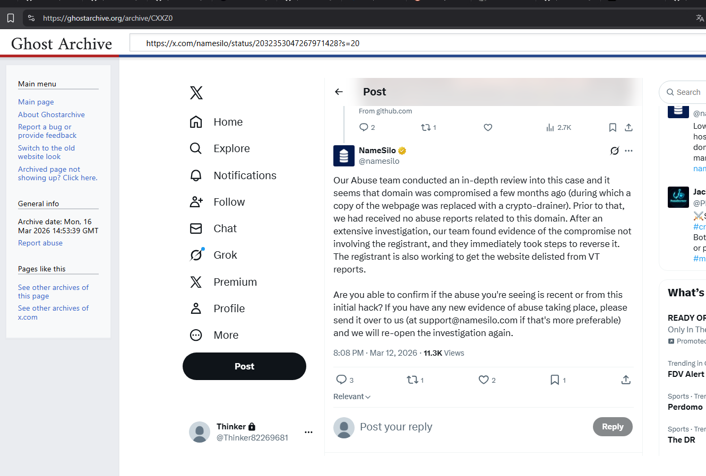
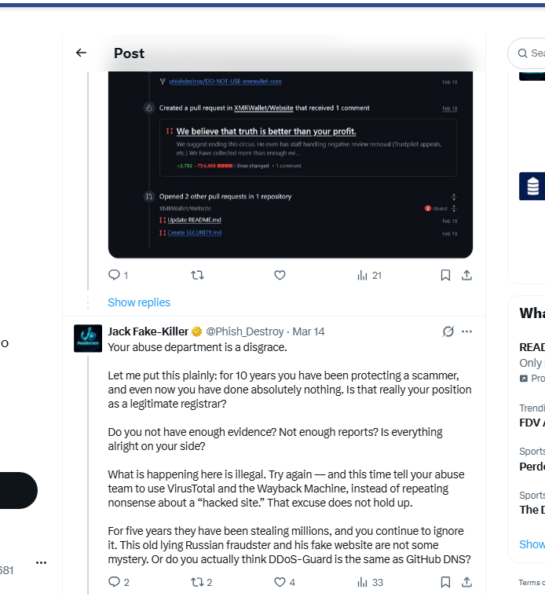
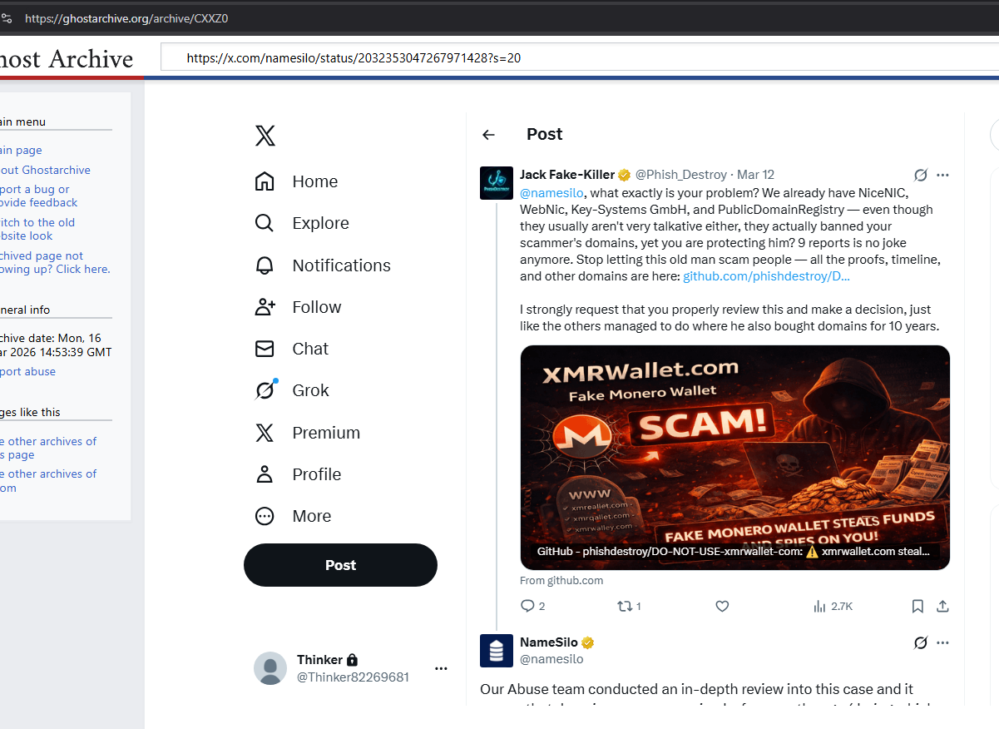

<!--
NameSilo, LLC (IANA #1479) — Registrar Abuse Investigation
Canonical: https://phishdestroy.github.io/namesilo-evidence/
Keywords: namesilo, xmrwallet, monero-drainer, crypto-scam, registrar-abuse, icann-compliance, phishdestroy
-->

<div align="center">


<br/>

[](LICENSE)
[](EVIDENCE_HASHES.txt)
[](https://www.icann.org/compliance)
[](https://phishdestroy.github.io/namesilo-evidence/)

<br/>


</div>

---

## Overview

This repository contains a complete, SHA-256-verified evidence package documenting systemic abuse-facilitation by **NameSilo, LLC (IANA #1479)**, a US-based ICANN-accredited domain registrar.

We conducted a full census scan of all **5,269,357** active NameSilo domains — no sampling, every domain — and found that **87.3% serve no legitimate purpose**: parking, redirect chains, phishing kits, gambling operations, and fraud infrastructure. A parallel investigation of NameSilo's proprietary WHOIS-privacy service, **PrivacyGuardian.org**, identified **183,419 confirmed-malicious domains** shielded behind the same company that registered them.

The anchor case is **xmrwallet[.]com** — a Monero wallet drainer operating continuously since **~2016**, draining an estimated **$10–20M** in user funds via server-side private-key exfiltration. Over **20 delivery-receipted abuse reports** were submitted to NameSilo between 2023 and 2026. NameSilo took no action. When confronted publicly on March 13, 2026, NameSilo's corporate account published four factually false statements defending the operator and committed in writing to assisting him in **removing VirusTotal detections**. Three other registrars (PDR, WebNic, NICENIC) reviewed the same evidence and suspended the domain within days. NameSilo, LLC (IANA #1479) published a press release for him.

**Their only documented response to this investigation: the scammer's domain was quietly transferred to Namecheap. No factual rebuttal. No suspension. No corrective action.**

The full case file was submitted to **ICANN Contractual Compliance on March 18, 2026**.

---

## Investigation Scale

<div align="center">

| Metric | Value | Source |
|:-------|------:|:-------|
| Total NameSilo domains scanned | **5,269,357** | Complete zone file census |
| Domains with no legitimate use | **4,600,249 (87.3%)** | HTTP + content classification |
| Brand-phishing domains | **3,726** | Favicon fingerprint + content |
| Indonesian gambling cluster (confirmed) | **19,198** | MurmurHash3 favicon clustering |
| Single server fingerprint cluster | **328,230** | SHA-256(Server+XPB+ETag) |
| CF-confirmed phishing on that cluster | **2,062** | Cloudflare threat feed |
| Malicious behind PrivacyGuardian | **183,419** | RDAP + 25 threat intelligence feeds |
| Hard-confirmed malicious (3+ sources) | **109,196** | Multi-source cross-validation |
| Brand impersonations identified | **201** | Content + title analysis |
| Dead domains: NameSilo vs industry avg | **32.2% vs 14–21%** | 8-registrar, 130M domain comparison |
| xmrwallet.com estimated victim losses | **$10M–$20M** | On-chain + victim reports |
| Years of continuous operation | **~10 (2016–2026)** | Domain history + archived content |
| Abuse reports submitted to NameSilo | **20+** (delivery-receipted) | Submission records |
| Other registrars that suspended | **3** (PDR, WebNic, NICENIC) | Suspension notices |

</div>

---

## Methodology

Two-pass distributed scanner — AWS Lambda + GCP Cloud Run, up to 400 concurrent workers:

```
Phase 1 — Initial scan (AWS Lambda, 400 concurrent workers)
  2,503,213 domains probed  |  aiohttp/asyncio  |  5s timeout

Phase 2 — Rescan of missed domains (GCP Cloud Run, 20 containers × 400 async)
  894,300 additional domains probed

Merged output: 3,397,413 domains with DNS → 1,129,114 active HTTP responses
```

Classification pipeline:

```
HTTP response
  ├── Page-type classifier    active_content / parking / redirect / phishing / ...
  ├── Favicon fingerprint     MurmurHash3 → operator clusters
  ├── Server fingerprint      SHA-256(Server + X-Powered-By + ETag) → 12-char hex
  ├── Parking detection       named service patterns (namesilo / sedo / godaddy / ...)
  └── Brand matching          domain name + title + favicon hash → phishing label
```

PrivacyGuardian investigation (separate pipeline):

```
NameSilo zone file (4,974,265 candidate PG domains)
  └── RDAP validation against rdap.namesilo.com
        └── 164,027 CONFIRMED PrivacyGuardian-protected
              └── Cross-referenced: 25+ independent threat intelligence feeds
                    └── 183,419 confirmed malicious  |  109,196 hard-confirmed (3+ sources)
```

---

## Timeline

```
2016          xmrwallet.com goes live.
              session_key transmitted to operator server 40+ times per session.
              raw_tx_and_hash.raw = 0 discards all client-side transactions.

2023–2026     PhishDestroy: 20+ delivery-receipted abuse reports → abuse@namesilo.com
              NameSilo response: no action taken.

Feb 16, 2026  Operator emails PhishDestroy: "There is no phishing."
              No claim of compromise. No mention of a hack.

Mar 12, 2026  PhishDestroy: "9 reports is no joke anymore." — public tweet.

Mar 13, 2026  NameSilo official corporate tweet (11,300 views, archived):
              [FALSE]   "Domain was compromised a few months ago"
              [FALSE]   "No abuse reports received prior to this"
              [FALSE]   "The registrant is also the victim"
              [DAMNING] "Working with registrant to remove website from VT reports"

              PDR, WebNic, NICENIC: suspended the same domain within days.
              NameSilo: published a press release on the operator's behalf.

Mar 16, 2026  PhishDestroy publishes operator emails and receipts publicly.
              NameSilo uses X Gold Checkmark live-support to lock @Phish_Destroy.

Mar 18, 2026  Full case file submitted to ICANN Contractual Compliance.

Apr 15, 2026  X automated review: "No violation. Account restored to full functionality."
              Human agent override applied. Account remains locked.

May 11, 2026  NameSilo legal threat tweet: "false, libelous and defamatory."
              Zero factual rebuttal provided. (see NAMESILO-RESPONSE-MAY2026.md)

May 2026      NameSilo receives DMCA against this investigation. Site not delisted.
              Keyword/geo suppression detected — investigation not appearing in
              geo-targeted search results for relevant terms.

Jun 2026      Full zone scan complete: 5,269,357 domains, 87.3% junk.
              NameSilo's sole action: scammer's domain transferred to Namecheap.
              Site remains live. Operator unidentified to victims.
```

---

## Interactive Reports

<div align="center">

| Report | Description | Link |
|:-------|:------------|:-----|
| Zone Scan Report | Full investigation: charts, IOC breakdown, chain of custody | [namesilo-scan.html](https://phishdestroy.github.io/namesilo-evidence/namesilo-scan.html) |
| Favicon Cluster Analysis | 12 operator clusters via MurmurHash3 fingerprinting | [namesilo-clusters.html](https://phishdestroy.github.io/namesilo-evidence/namesilo-clusters.html) |
| IOC Domain List | 107,252 criminal domains — searchable, with flags and favicons | [namesilo-domains.html](https://phishdestroy.github.io/namesilo-evidence/namesilo-domains.html) |
| PrivacyGuardian Shield | 183,419 malicious domains behind NameSilo's own WHOIS privacy service | [namesilo-privacyguardian.html](https://phishdestroy.github.io/namesilo-evidence/namesilo-privacyguardian.html) |
| Review Manipulation & PR Newswire | 129 Trustpilot reviews deleted, bot network, same-day PR Newswire with scammer | [namesilo-reviews.html](https://phishdestroy.github.io/namesilo-evidence/namesilo-reviews.html) |
| Investigation Index | Main GitHub Pages portal with links to all reports | [phishdestroy.github.io/namesilo-evidence](https://phishdestroy.github.io/namesilo-evidence/) |

</div>

> Raw scan data (JSONL/CSV, up to 499 MB uncompressed) available as gzip archives in [`pkg/raw_data/`](pkg/raw_data/).

---

## Repository Structure

```
namesilo-evidence/
│
├── README.md                               ← this file
├── PROOFS.md                               ← master evidence index, every exhibit SHA-256 verified
├── INVESTIGATION_DOSSIER_EN.md             ← complete investigation dossier (613 lines)
├── ARTICLE_FULL.md                         ← full investigative article
├── CONNECTION.md                           ← NameSilo ↔ xmrwallet operator evidence chain
├── THE-LIES.md                             ← line-by-line rebuttal of NameSilo's March 13 statement
├── NAMESILO-RESPONSE-MAY2026.md            ← May 11 legal threat tweet, documented and archived
├── NAMESILO_DOMAIN_ANOMALY_REPORT.md       ← 8-registrar statistical analysis, 130M domains
├── PRESSURE.md                             ← suppression campaign log (DMCA, DDoS, account lock)
├── SCAM_TECHNICAL.md                       ← xmrwallet technical breakdown (8 PHP endpoints)
├── XMRWALLET_TECHNICAL.md                  ← server-side key drainer case file
├── OPERATOR_PROFILE.md                     ← operator dossier: identity, domains, IPs, IOCs
├── VICTIMS.md                              ← documented victims, 2016–2026 timeline
├── SOURCES.md                              ← permanent archive URLs for all external claims
├── EVIDENCE_INDEX.md                       ← every screenshot indexed with SHA-256
├── EVIDENCE_HASHES.txt                     ← SHA-256 checksums for all evidence files
├── TWITTER_ARCHIVE.md                      ← archived tweet thread before account lock
├── MEDIUM_MIRROR.md                        ← Medium article mirror
├── CITATION.cff                            ← machine-readable citation (legal/academic)
├── LICENSE                                 ← CC-BY-4.0, explicit grant for legal/regulatory use
│
├── evidence/                               ← 16 SHA-256 verified screenshots
│   ├── 01-operator-email-feb16.png
│   ├── 03-namesilo-statement-mar13.png
│   ├── 06-x-support-no-violation.png
│   └── ...                                 ← (see EVIDENCE_INDEX.md for full list)
│
├── docs/                                   ← GitHub Pages (phishdestroy.github.io/namesilo-evidence/)
│   ├── index.html                          ← investigation portal
│   ├── namesilo-scan.html                  ← zone scan report
│   ├── namesilo-clusters.html              ← favicon cluster analysis
│   ├── namesilo-domains.html               ← 107,252 IOC domains (searchable)
│   ├── namesilo-privacyguardian.html       ← 183,419 PG-shielded malicious domains
│   ├── behavioral-patterns.html            ← behavioral pattern analysis
│   ├── assets/                             ← 11 forensic diagrams (PNG)
│   └── evidence/                           ← SHA-256 manifest (evidence_manifest.json)
│
├── pkg/                                    ← zone scan evidence package
│   ├── report.html                         ← zone scan report (source)
│   ├── clusters.html                       ← favicon cluster analysis (source)
│   ├── domains.html                        ← IOC domain list (source)
│   ├── evidence/                           ← JSON evidence files + manifest
│   └── raw_data/                           ← gzip scan datasets (JSONL/CSV archives)
│
├── xmrwallet-evidence/                     ← xmrwallet-specific evidence package
│   ├── EVIDENCE_HASHES.txt
│   ├── LOST_FUNDS.md
│   └── ...
│
└── tools/                                  ← archival tooling (Wayback, archive.ph, IPFS pin)
```

---

## Forensic Diagrams

<div align="center">

| | | |
|:-:|:-:|:-:|
| [](docs/assets/diagram-money-flow.png) | [](docs/assets/diagram-timeline.png) | [](docs/assets/diagram-theft-mechanism.png) |
| Money Flow | 10-Year Timeline | Theft Mechanism |
| [](docs/assets/diagram-operator-network.png) | [](docs/assets/diagram-suppression.png) | [](docs/assets/diagram-domain-infra.png) |
| Operator Network | Suppression Campaign | Domain Infrastructure |

</div>

---

## Evidence Chain of Custody

Every screenshot in `evidence/` has a SHA-256 fingerprint in [`EVIDENCE_HASHES.txt`](EVIDENCE_HASHES.txt). To verify integrity:

```bash
git clone https://github.com/phishdestroy/namesilo-evidence.git
cd namesilo-evidence/evidence
sha256sum -c ../EVIDENCE_HASHES.txt
# Expected: all files report OK
```

Full evidence manifest with timestamps and hashes: [`pkg/evidence/evidence_manifest.json`](pkg/evidence/evidence_manifest.json)

---

## Key Facts — NameSilo vs. Facts

| NameSilo's Public Statement | The Record | Verdict |
|:---|:---|:---:|
| "Domain was compromised a few months ago." | The exfiltration code *is* the product — 8 PHP endpoints, server-side `session_key` capture, `raw_tx_and_hash.raw = 0`. Operator's own February 16 email makes no mention of a hack. | **FALSE** |
| "Prior to that, we had received no abuse reports." | 20+ delivery-receipted reports, 2023–2026. Our public tweet the day before states "9 reports is no joke anymore." | **FALSE** |
| "After an extensive review… not involving the registrant." | Operator wrote to PhishDestroy on February 16, 2026 defending the site as his own. NameSilo adopted a narrative the operator himself never advanced. | **FALSE** |
| "Working with registrant to remove website from VT reports." | Documented in their own tweet. A registrar actively assisting a confirmed fraud operator in erasing consumer-protection security alerts. | **DOCUMENTED** |

> Full rebuttal: [`THE-LIES.md`](THE-LIES.md) · Full operator evidence chain: [`CONNECTION.md`](CONNECTION.md)

---

## Suppression Timeline

| Date | Incident | Status |
|:-----|:---------|:-------|
| Mar 13, 2026 | NameSilo publishes four-lie defense on X | [Archived](https://ghostarchive.org/archive/CXXZ0) |
| Mar 16, 2026 | @Phish_Destroy posts operator emails publicly | Tweets now invisible |
| Mar 18, 2026 | Filed with ICANN + law enforcement | On record |
| Mar 2026 | @Phish_Destroy locked via X Gold Checkmark live support | **Still locked** |
| Apr 15, 2026 | X automation: "no violation, account restored" | Lock not lifted. Gold still billed. |
| May 11, 2026 | NameSilo legal threat tweet. Zero factual rebuttal. | [Documented](NAMESILO-RESPONSE-MAY2026.md) |
| May 2026 | DMCA filed against this investigation | Site not delisted |
| May 2026 | Keyword/geo suppression — site absent from geo-targeted search results | Under documentation |
| Jun 2026 | Scammer's domain transferred to Namecheap. No other action. | Site live |

> Full documentation: [`PRESSURE.md`](PRESSURE.md)

---

## For Victims, Regulators, and Press

**Victims of xmrwallet[.]com** — this repository is a ready-made evidence package for:
- [IC3 (FBI) cybercrime complaint](https://www.ic3.gov)
- [FTC complaint](https://reportfraud.ftc.gov)
- [ICANN Contractual Compliance complaint](https://www.icann.org/compliance) against NameSilo, LLC (IANA #1479)
- Civil proceedings, police reports, insurance filings

The [`LICENSE`](LICENSE) file grants explicit written permission to use this evidence in any legal or regulatory proceeding without further authorization from PhishDestroy.

Contact: **[report@phishdestroy.io](mailto:report@phishdestroy.io)** · [Open a Victim Report issue](.github/ISSUE_TEMPLATE/victim-report.yml)

**Regulators and journalists** — full case file forwarded to ICANN Contractual Compliance, March 18, 2026. Raw materials (email headers, PHP endpoint captures, historical abuse-report delivery receipts) available on request: **[abuse@phishdestroy.io](mailto:abuse@phishdestroy.io)**

---

## Mirrors

| Platform | URL |
|:---------|:----|
| GitHub Pages (primary) | [phishdestroy.github.io/namesilo-evidence](https://phishdestroy.github.io/namesilo-evidence/) |
| ENS + IPFS | [phishdestroy.eth.limo](https://phishdestroy.eth.limo/) |
| Arweave (permanent) | [arweave.net/LUuditolJS-Y15IezfpzRI36sxhd1CIvFNOf_eAG2AU](https://arweave.net/LUuditolJS-Y15IezfpzRI36sxhd1CIvFNOf_eAG2AU) |
| Codeberg | [codeberg.org/phishdestroy/namesilo-evidence](https://codeberg.org/phishdestroy/namesilo-evidence) |
| Medium | [phishdestroy.medium.com](https://phishdestroy.medium.com/namesilo-lied-to-defend-a-20m-crypto-scam-then-took-down-our-twitter-4904d15d531e) |
| GhostArchive (NameSilo tweet) | [ghostarchive.org/archive/CXXZ0](https://ghostarchive.org/archive/CXXZ0) |
| Wayback (this repo) | [web.archive.org snapshot](https://web.archive.org/web/20260508165630/https://github.com/phishdestroy/namesilo-evidence) |
| IPFS CID | `bafybeibihjlg4wdmiur2k57c6be4fkttju5kekqsyuq7kl4a3uoeg65xlq` |

---

## Exhibit A — NameSilo's statement, verbatim

**March 13, 2026** — NameSilo's official corporate account, in reply to our investigation thread. Four sentences. Four verifiably false claims. 11,300 public views. Permanently archived: [ghostarchive.org/archive/CXXZ0](https://ghostarchive.org/archive/CXXZ0)

<div align="center">


*NameSilo, LLC (IANA #1479) (@namesilo), March 13, 2026.*

</div>

We had confronted them the day before: *"9 reports is no joke anymore."* Their response was not to act on the reports — it was to publicly defend the operator. Two days later, we documented the contradiction:

<div align="center">


*@Phish_Destroy, March 16, 2026. Account locked shortly after this post.*

</div>

---

## Exhibit B — The operator's own email, February 16, 2026

The operator contacted PhishDestroy directly. He defended the site as his own product. He made no claim of a hack or compromise. This email alone refutes NameSilo's "domain was compromised" narrative, published 25 days later.

<div align="center">


*Operator, February 16: "There is no phishing going on with xmrwallet.com." No mention of a compromise.*

</div>

PhishDestroy replied the same day with a complete technical analysis — 8 PHP endpoints, `session_key` exfiltration, `raw_tx_and_hash.raw = 0` — and a notice of escalation:

<div align="center">


*"What happens next depends entirely on how you choose to proceed." — PhishDestroy, February 16, 2026.*

</div>

---

## Exhibit C — X Support confirmed no violation. Account remains locked.

After our public escalation to ICANN, the @Phish_Destroy account was permanently locked. X's own automated review found no violation and issued a restoration notice in writing:

<div align="center">

<table><tr>
<td width="50%">


</td>
<td width="50%">


</td>
</tr></table>

*X Support, April 15, 2026: "No violation. Restored to full functionality." The account remains locked. The Gold subscription remains billed. A human agent — accessible via NameSilo's paid Gold Checkmark support — overrode the automated decision.*

</div>

Full documentation: [`PRESSURE.md`](PRESSURE.md)

---

## Exhibit D — The question that was never answered

<div align="center">


*"Who is this operator to you?" — @Phish_Destroy, March 16, 2026. 72 likes, 7.9K views. Not answered. Account locked.*

</div>

---

## Exhibit E — GhostArchive: the record they cannot delete

[GhostArchive snapshot](https://ghostarchive.org/archive/CXXZ0), archived March 16, 2026, before account suppression. NameSilo's official reply, our responses, and timestamps are all preserved.

<div align="center">



*GhostArchive — our original tweet, March 12. "9 reports is no joke anymore." Below: NameSilo's official reply.*

</div>

<div align="center">


*NameSilo's full statement — "working with registrant to remove website from VT reports." 11,300 public views.*

</div>

---

## Exhibit F — The thread they locked (March 14, 2026)

Posts published two days before the account was locked. Direct confrontation with NameSilo on each false claim.

<div align="center">



*"The 'hack' story is a lie, and the claim that there were no earlier reports is also a lie. Reports from PhishDestroy existed, and this can be verified even through public tweets."*

</div>

<div align="center">


*"Your abuse department is a disgrace. For 10 years you have been protecting a scammer, and even now you have done absolutely nothing. What is happening here is illegal."*

</div>

<div align="center">



*"New service from NameSilo: helping scammers get VirusTotal bans removed." — Cycle: Abuse report filed → complaint filed → report ignored → NameSilo: 'working to get delisted from VT.'*

</div>

---

## The core connection — summary

A scammer operating a ten-year crypto drainer, on bulletproof hosting in Belize, behind Russian DDoS-Guard, wrote on **February 17, 2026**: *"Feel free to subpoena the domain registrar for my information."* Twenty-four days later, **NameSilo, LLC (IANA #1479)** published an official tweet calling him **"the victim"** of a hypothetical hack, denying 20+ abuse reports, and announcing a commitment to **clean up his VirusTotal detections**. Three other registrars reviewed the same evidence and suspended within days. NameSilo wrote a press release for him. **The connection was put into the public record by NameSilo themselves.** This repository is the evidence.

> Full evidence chain: [`CONNECTION.md`](CONNECTION.md)

---

<div align="center">

**PhishDestroy Research** · [phishdestroy.github.io/namesilo-evidence](https://phishdestroy.github.io/namesilo-evidence/) · [phishdestroy.eth.limo](https://phishdestroy.eth.limo/) · [abuse@phishdestroy.io](mailto:abuse@phishdestroy.io)

*TLP:CLEAR · CC-BY-4.0 · Evidence chain of custody maintained from first report, 2023, to present.*

</div>
