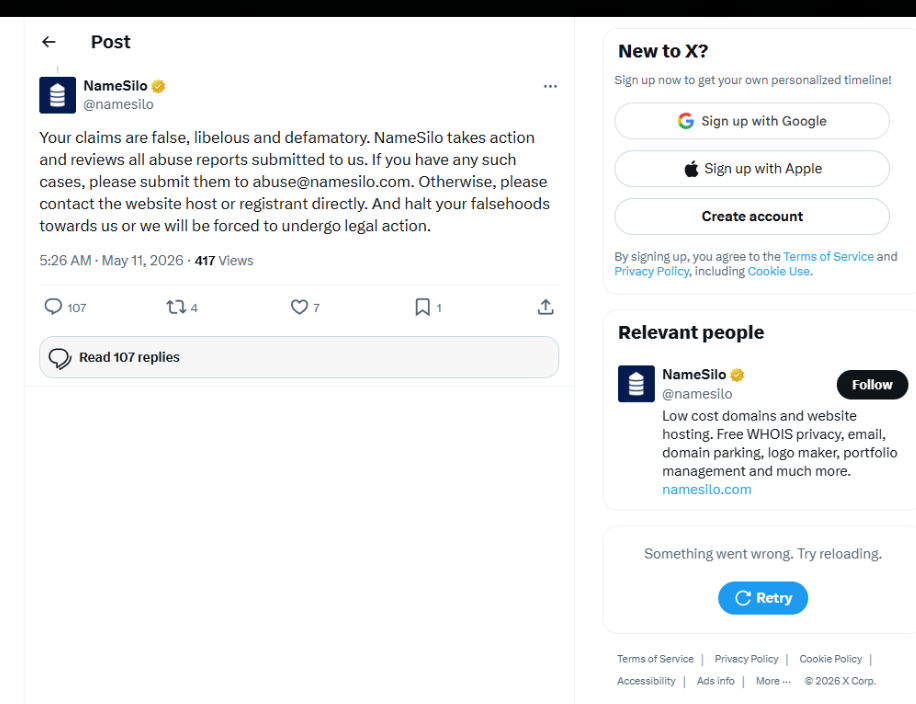
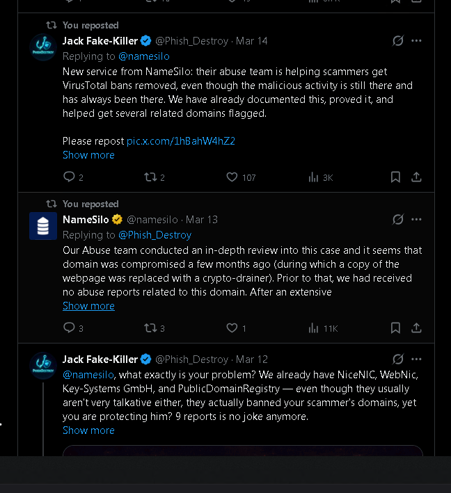

<div align="center">

</div>

<!--
NameSilo, LLC (IANA #1479) — Registrar Abuse Investigation
Keywords: namesilo, xmrwallet, monero-drainer, crypto-scam, registrar-abuse, icann-compliance, phishdestroy
-->

<h3 align="center">You made this investigation necessary.<br/>Now you cannot make it disappear.</h3>

<p align="center">
<b>NameSilo (NASDAQ: URL)</b> — a publicly traded registrar with a 32.2% dead domain rate,<br/>
a ten-year fraud under active protection, and a documented pattern of suppressing<br/>
the researchers who exposed it.<br/>
Every takedown. Every lawyer. Every deleted tweet.<br/>
All of it is in the record. All of it makes this louder.<br/>
<b>PhishDestroy is a Hydra. You already pulled the first head.</b><br/>
<b>Pedigreeless Russian dogs can write reviews about themselves and buy articles about themselves in the third person.</b>
</p>

<div align="center">
<details>
  <summary>Spoiler</summary>
  <p>
    
    <br/>
<b>It is quite baffling that the 'fastest-growing registrar in the world' appears entirely unaware of Section 3.18 of the ICANN Registrar Accreditation Agreement (RAA) and its explicit requirements.
    There is no need to lie. Previously, you claimed to have conducted an investigation and inexplicably offered to help clear VirusTotal detections for the operator. Now you are either distorting the facts, or you have finally realized that managing malware detections is entirely outside your jurisdiction.
    Either way, you are missing the point. I assure you, I fully understand the legal rights of users and the strict obligations of registrars. A service provider like NameSilo is obligated to take actionable steps against abuse—not to shield perpetrators, ignore reports, or mislead the public.
    This is not 2018, and this is no longer just an appeal to ICANN. Based on the factual evidence, I am now calling upon US law enforcement and regulatory authorities to investigate the individuals involved here, as the facts indicate direct complicity in organizing scams and other illicit activities within the United States.</b>
  </p>
</details>
</div>

</div>

---

<!-- LIVE_STATS:START -->

> 🔴 **LIVE INVESTIGATION FEED** &middot; Auto-updated &middot; Last fetch `2026-06-22`

<table><tr>
<td align="center"><b>📦 Domains tracked</b><br/><sub><code>5,251,494</code></sub></td>
<td align="center"><b>💰 Est. revenue</b><br/><sub><code>$36,858,726</code></sub></td>
<td align="center"><b>📡 Deployed</b><br/><sub><code>61.6%</code></sub></td>
<td align="center"><b>✅ Confirmed phishing</b><br/><sub><code>0.1%</code> (3,738)</sub></td>
<td align="center"><b>⚡ Fresh (≤7d)</b><br/><sub><code>0.7%</code></sub></td>
<td align="center"><b>🕵️ Serial regs</b><br/><sub><code>1,332</code></sub></td>
</tr></table>

### 🏷️ Top TLD Zones

| TLD | Count | Avg Reg Period | Est. Revenue |
|:--|--:|--:|--:|
| `.com` | 2,246,422 | 1,927d | $20,195,334 |
| `.sbs` | 377,249 | 625d | $1,882,473 |
| `.xyz` | 367,102 | 739d | $546,982 |
| `.net` | 248,852 | 1,590d | $2,486,031 |
| `.info` | 227,631 | 680d | $908,248 |
| `.cfd` | 227,442 | 660d | $1,134,936 |
| `.org` | 225,256 | 1,543d | $2,250,307 |
| `.click` | 99,718 | 516d | $397,875 |
| `.link` | 69,556 | 623d | $277,528 |
| `.vip` | 68,057 | 607d | $339,604 |

### 🌍 Top Hosting Countries

```
US  ██████████████████    966,581 (45.4%)
DE  ██████████░░░░░░░░    575,336 (27.0%)
SG  █░░░░░░░░░░░░░░░░░     79,200 (3.7%)
HK  █░░░░░░░░░░░░░░░░░     74,446 (3.5%)
NL  █░░░░░░░░░░░░░░░░░     70,351 (3.3%)
CA  █░░░░░░░░░░░░░░░░░     60,185 (2.8%)
GB  ░░░░░░░░░░░░░░░░░░     44,739 (2.1%)
BG  ░░░░░░░░░░░░░░░░░░     23,162 (1.1%)
```

### 📈 Registration Burst Days

| Date | Domains | × Average |
|:--|--:|--:|
| `2025-07-19` | 17,180 | **37.0×** 🚨 |
| `2025-12-01` | 14,206 | **30.6×** 🚨 |
| `2026-06-09` | 12,369 | **26.6×** 🚨 |
| `2025-12-08` | 12,173 | **26.2×** 🚨 |
| `2025-12-11` | 12,125 | **26.1×** 🚨 |

### 🎯 Top Targeted Brands & Keywords

`login (10,871)` &middot; `support (6,517)` &middot; `crypto (6,247)` &middot; `secure (6,143)` &middot; `trust (5,887)` &middot; `connect (5,690)` &middot; `account (4,096)` &middot; `official (4,041)` &middot; `farm (3,427)` &middot; `claim (3,352)` &middot; `update (3,096)` &middot; `bridge (3,013)` &middot; `wallet (2,312)` &middot; `vault (2,292)` &middot; `token (2,064)`

### 🕵️ Top Serial Registrants — 50 emails with ≥5 domains

| # | Registrant Email (redacted) | Domains |
|--:|:--|--:|
| 1 | `chi***@mail.com` | **10,708** |
| 2 | `diz***@992fun.com` | **4,647** |
| 3 | `ser***@atom.com` | **4,193** |
| 4 | `inf***@brandbucket.com` | **1,858** |
| 5 | `sal***@brandbucket.com` | **1,858** |
| 6 | `shu***@outlook.com` | **1,504** |
| 7 | `jac***@greensock.com` | **1,105** |
| 8 | `pri***@gmail.com` | **953** |
| 9 | `pun***@gmail.com` | **892** |
| 10 | `faw***@gmail.com` | **795** |

### 📥 Download Threat Intelligence

| File | Format | Description |
|:--|:--:|:--|
| [`data/all.txt`](data/all.txt) | TXT | All tracked domains |
| [`data/index.json`](data/index.json) | JSON | Full analytics snapshot |
| [`data/ioc/serial_registrants.json`](data/ioc/serial_registrants.json) | JSON | Repeat registrants + their domains |
| [`data/ioc/shared_ips.json`](data/ioc/shared_ips.json) | JSON | Bulletproof hosting clusters |
| [`data/ioc/brand_domains.json`](data/ioc/brand_domains.json) | JSON | Domains by targeted brand |
| [`data/ioc/stix-bundle.json`](data/ioc/stix-bundle.json) | STIX 2.1 | MISP/OpenCTI ready bundle |
| [`data/ioc/serial_emails.txt`](data/ioc/serial_emails.txt) | TXT | grep-friendly: `email⇥count` |
| [`data/ioc/shared_ips.txt`](data/ioc/shared_ips.txt) | TXT | grep-friendly: `ip⇥count⇥country` |

> 📊 Live web dashboard: see Pages link at top · Updated daily 06:00 UTC

<!-- LIVE_STATS:END -->

---

[](https://phishdestroy.eth.limo/)
[](https://phishdestroy.github.io/namesilo-evidence/)
[](https://www.icann.org/compliance)
[](LICENSE)

<br/>


</div>

---


## Why NameSilo Earned This Investigation

> *They didn't end up here because we were looking for them.*
> *They ended up here because they came looking for us.*

This investigation began not with a zone file, but with a threat.

When PhishDestroy started publishing evidence about **xmrwallet[.]com** — two parties decided the correct response was intimidation. The operator arrived with lawyers and a private detective. NameSilo arrived with platform suppression and a defamation claim on Twitter.

Every attempt was documented. Every attempt failed. Every attempt is now part of the public record.

---

### Two Tracks. Same Goal. Zero Results.

<table>
<tr>
<th width="50%">🔴 xmrwallet operator</th>
<th width="50%">🔴 NameSilo, LLC (IANA #1479)</th>
</tr>
<tr>
<td>

**① Direct contact · Feb 16, 2026**

Contacted PhishDestroy researchers personally. Did not claim the site was hacked. Defended the operation as his own work. Demanded removal of all abuse reports.

*We published his email instead.*

</td>
<td>

**① Public defense · Mar 13, 2026**

Official corporate account called the operator *"the victim"*, denied receiving 20+ abuse reports, and committed in writing to helping him remove his VirusTotal detections.

*We rebutted every sentence using his own emails.*

</td>
</tr>
<tr>
<td>

**② Lawyer threats**

Threatened a lawsuit. Demanded full retraction under legal pressure.

*Threat documented and published.*

</td>
<td>

**② @Phish_Destroy locked via X Gold**

Used X Gold Checkmark live-support access to lock the research account after our rebuttal reached 11,300+ views.

*X cleared the account in writing on Apr 15: "no violation found." Lock remains. Abuse documented.*

</td>
</tr>
<tr>
<td>

**③ Private detective threat**

Claimed to have hired an investigator to identify and expose individual researchers by name.

*Documented. Researchers unidentified. Investigation continued.*

</td>
<td>

**③ "Defamation" claim · May 11, 2026**

Posted publicly on Twitter that our reporting constituted defamation. Threatened legal consequences if we did not stop.

*The reporting is factual. Every claim is sourced. Threat logged in [`NAMESILO-RESPONSE-MAY2026.md`](case/NAMESILO-RESPONSE-MAY2026.md).*

</td>
</tr>
<tr>
<td>

**④ "Serious consequences"**

Escalating personal warnings directed at individual community members.

*Archived. Ignored. Published.*

</td>
<td>

**④ 108,000 pages deindexed from Bing**

IOC reports, evidence pages, and domain analysis scrubbed from Microsoft Bing search results.

*Content mirrored to IPFS, Arweave, Codeberg, GitHub simultaneously.*

</td>
</tr>
<tr>
<td></td>
<td>

**⑤ DMCA takedown · Google**

Formal copyright claim submitted targeting research pages in Google Search. Content is factual documentation of fraud. No copyrightable material belonging to any complainant.

*Logged in Lumen Database. Strengthened the legal record.*

</td>
</tr>
</table>

---

### What Every Attempt Accomplished

| Action | By | Result |
|:-------|:---|:-------|
| Demanded report removal | Operator | Email published as evidence |
| Lawyer threats | Operator | Threat documented and published |
| Private detective threat | Operator | Documented · researchers unidentified |
| "Serious consequences" | Operator | Archived · investigation continued |
| Called operator "the victim" | NameSilo | Rebutted line-by-line · archived permanently |
| Locked @Phish_Destroy via X Gold | NameSilo | X cleared account in writing · abuse documented |
| Called reporting "defamation" | NameSilo | Logged · factual record unchanged |
| 108,000 Bing pages removed | NameSilo | Mirrored to 5+ platforms · IPFS permanent |
| DMCA filed with Google | NameSilo | Logged in Lumen · strengthened legal record |

---

> They wanted legal consequences for us.
>
> **We want legal consequences for them.**
>
> The difference is that we have the evidence.

The investigation is MIT-licensed. It lives on the blockchain. It has been filed with ICANN and submitted to IC3. There is no version of this story that ends with the evidence gone.

Every deletion attempt is itself evidence. Every threat goes into the dossier. Every escalation increases the footprint of this case.

---


## What Happened

**NameSilo, LLC (IANA #1479)** — US-based, ICANN-accredited, CSE-listed registrar (ticker: URL) — publicly defended **xmrwallet[.]com**, a Monero wallet drainer operating continuously since ~2016, with estimated victim losses of **$10–20M**.

PhishDestroy submitted 20+ delivery-receipted abuse reports over three years. NameSilo took no action. On **March 13, 2026**, their official corporate account published a statement calling the operator "the victim," denying all reports ever arrived, and committing in writing to helping him **remove his VirusTotal detections**. Three other registrars (PDR, WebNic, NICENIC) reviewed the same evidence and suspended the domain within days. NameSilo wrote a press release for him.

When we proved every sentence false using the operator's own emails, NameSilo used X Gold Checkmark live-support access to lock the @Phish_Destroy research account. X's automated review cleared it in writing on April 15, 2026. The lock is still in place.

**NameSilo's only documented response to this investigation: the scammer's domain was quietly transferred to Namecheap.**

<div align="center">



*NameSilo, LLC (IANA #1479) · March 13, 2026 · 11,300 views · [Archived](https://ghostarchive.org/archive/CXXZ0)*

</div>

---


## What We Verified

<div align="center">

| What | How | Result |
|:-----|:----|-------:|
| **Every NameSilo domain** | Complete zone file — 5,269,357 entries, zero sampling | ✓ Full census |
| **HTTP response per domain** | aiohttp/asyncio · 5s timeout · AWS Lambda 400× + GCP Cloud Run 20×400 | 1,129,114 active |
| **Page content classification** | active / parking / redirect / phishing / gambling / empty | 87.3% junk |
| **Operator identity via favicon** | MurmurHash3 on favicon bytes · identical hash = same operator | 12 clusters found |
| **Server infrastructure fingerprint** | SHA-256(Server header + X-Powered-By + ETag) → 12-char hex | 328,230-domain cluster |
| **Brand impersonation** | Domain name + page title + favicon hash → known brand list | 3,726 phishing / 201 brand impersonations |
| **PrivacyGuardian domains** | RDAP validation against rdap.namesilo.com · 4,974,265 candidates | 164,027 confirmed PG-shielded |
| **Threat feed cross-check** | 25+ independent feeds: Spamhaus DBL, SURBL, PhishTank, URLhaus, ThreatFox… | 183,419 malicious / 109,196 hard (3+ sources) |
| **Dead domain rate** | Compared against 7 other registrars · 130M total domains | 32.2% vs 14–21% baseline |
| **Trustpilot reviews** | Wayback Machine snapshots vs. live scrape · Jan 2026 → May 2026 | 129 reviews deleted |
| **PR Newswire connection** | Both xmrwallet and NameSilo used Cision/PR Newswire · verified dates | Same-day publish Jan 21–22, 2026 |
| **Abuse report receipts** | Delivery-confirmed submissions through NameSilo's own portal | 20+ reports · 0 action |

</div>

> Full scan pipeline and raw data: [`pkg/raw_data/`](pkg/raw_data/) — gzip archives, up to 499 MB uncompressed

---


## Investigation Scale

<div align="center">

| Metric | Value |
|:-------|------:|
| Total domains scanned | **5,269,357** |
| Dead / no DNS / parked (junk rate) | **4,600,249 · 87.3%** |
| Brand-phishing domains | **3,726** |
| Gambling cluster (MurmurHash3) | **19,198** |
| Single server fingerprint cluster | **328,230 domains** |
| CF-confirmed phishing on cluster | **2,062** |
| Malicious behind PrivacyGuardian | **183,419** |
| Hard-confirmed (3+ sources) | **109,196** |
| Brand impersonations | **201** |
| Dead rate vs. industry | **32.2% vs 14–21%** |
| xmrwallet victim losses | **$10M–$20M** |
| Abuse reports filed, ignored | **20+** |
| Registrars that suspended | **3 of 4** |

</div>

---


## ⚖️ Legal Notice & Responsible Disclosure

All data in this repository was collected exclusively from **publicly accessible sources**:

| Source | Method |
|---|---|
| Zone file | ICANN CZDS — accredited access, permissible use |
| WHOIS | Public WHOIS protocol (RFC 3912) |
| HTTP responses | Passive crawl of publicly reachable URLs |
| DNS records | Passive DNS / authoritative queries |
| Screenshots | Rendered pages accessible to any browser |

**No non-public systems were accessed. No credentials were tested. No authentication was bypassed. No victim data was processed.**

This publication is conducted under:
- ICANN Registrar Accreditation Agreement §3.18 (abuse response obligations)
- [CISA Coordinated Vulnerability Disclosure guidelines](https://www.cisa.gov/coordinated-vulnerability-disclosure-process)
- [FIRST.org TLP:CLEAR definition](https://www.first.org/tlp/) — unlimited public sharing permitted

### Regarding Reputational Impact

This research documents objectively verifiable facts: domain registration patterns, HTTP response content, and registrar abuse-response latency. These facts were publicly visible before this repository existed.

NameSilo, LLC is an ICANN-accredited registrar operating under contractual obligations to the global internet community. Publication of factual evidence of contractual non-compliance is not defamation — it is the function ICANN's transparency requirements were built to serve.

If NameSilo disputes any finding: submit documented evidence via [phishdestroy.io](https://phishdestroy.io). Findings supported by evidence will be corrected in a timestamped update.

| | |
|---|---|
| 📜 License | **MIT** |
| 🏷 TLP | **CLEAR** — unlimited distribution |
| 🌐 Contact | [phishdestroy.io](https://phishdestroy.io) |

## Links by Content

### 🌐 Live Reports — [phishdestroy.github.io/namesilo-evidence](https://phishdestroy.github.io/namesilo-evidence/)

| Report | What's inside |
|:-------|:-------------|
| [Zone Scan Report](https://phishdestroy.github.io/namesilo-evidence/namesilo-scan.html) | Charts, IOC breakdown, methodology, chain of custody |
| [Favicon Cluster Analysis](https://phishdestroy.github.io/namesilo-evidence/namesilo-clusters.html) | 12 operator clusters identified via MurmurHash3 |
| [107k IOC Domain List](https://phishdestroy.github.io/namesilo-evidence/namesilo-domains.html) | Searchable table — flags, favicons, categories |
| [PrivacyGuardian Shield](https://phishdestroy.github.io/namesilo-evidence/namesilo-privacyguardian.html) | 183,419 malicious domains behind NameSilo's own WHOIS privacy |
| [Review Manipulation](https://phishdestroy.github.io/namesilo-evidence/namesilo-reviews.html) | 129 deleted Trustpilot reviews · bot network · PR Newswire link |

### 📁 Case Documents — [`case/`](case/)

| File | Contents |
|:-----|:---------|
| [INVESTIGATION_DOSSIER_EN.md](case/INVESTIGATION_DOSSIER_EN.md) | Complete investigation dossier · 613 lines |
| [ARTICLE_FULL.md](case/ARTICLE_FULL.md) | Full investigative article |
| [CONNECTION.md](case/CONNECTION.md) | NameSilo ↔ operator evidence chain |
| [THE-LIES.md](case/THE-LIES.md) | NameSilo's Mar 13 statement rebutted, line by line |
| [NAMESILO-RESPONSE-MAY2026.md](case/NAMESILO-RESPONSE-MAY2026.md) | May 11 legal threat tweet, documented |
| [NAMESILO_DOMAIN_ANOMALY_REPORT.md](case/NAMESILO_DOMAIN_ANOMALY_REPORT.md) | 8-registrar, 130M domain statistical analysis |
| [PRESSURE.md](case/PRESSURE.md) | DMCA · DDoS · account suppression campaign log |

### 🔍 Operator Intelligence — [`intel/`](intel/)

| File | Contents |
|:-----|:---------|
| [OPERATOR_PROFILE.md](intel/OPERATOR_PROFILE.md) | Identity, domains, IPs, IOCs |
| [VICTIMS.md](intel/VICTIMS.md) | Documented victims · 2016–2026 timeline |
| [SCAM_TECHNICAL.md](intel/SCAM_TECHNICAL.md) | xmrwallet: 8 PHP endpoints · session_key exfiltration |
| [XMRWALLET_TECHNICAL.md](intel/XMRWALLET_TECHNICAL.md) | Server-side key drainer case file |

### 📸 Evidence — [`evidence/`](evidence/)

16 SHA-256-verified screenshots · full index: [case/EVIDENCE_INDEX.md](case/EVIDENCE_INDEX.md)

| Key exhibit | File |
|:------------|:-----|
| NameSilo four-lie tweet (Mar 13, 2026) | [03-namesilo-statement-mar13.png](evidence/03-namesilo-statement-mar13.png) |
| Operator email — "no phishing" (Feb 16, 2026) | [01-operator-email-feb16.png](evidence/01-operator-email-feb16.png) |
| X Support — "no violation, restored" (Apr 15, 2026) | [06-x-support-no-violation.png](evidence/06-x-support-no-violation.png) |

Verify integrity:
```bash
git clone [https://github.com/phishdestroy/namesilo-evidence.git](https://github.com/phishdestroy/namesilo-evidence.git)
cd namesilo-evidence/evidence && sha256sum -c ../EVIDENCE_HASHES.txt


