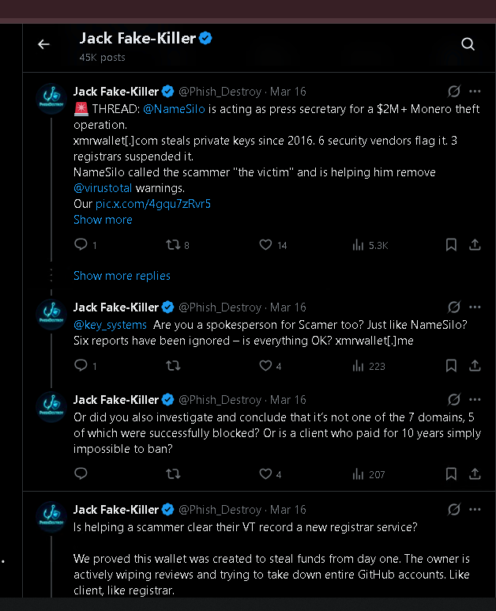
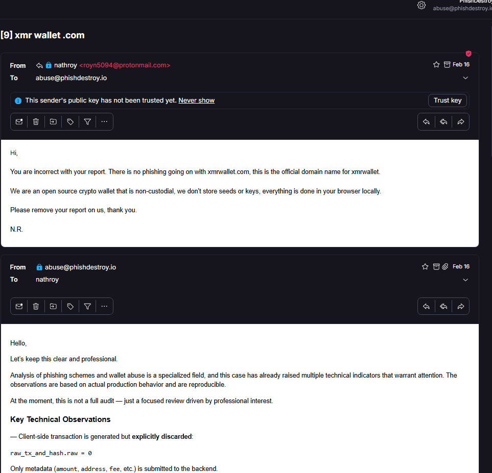
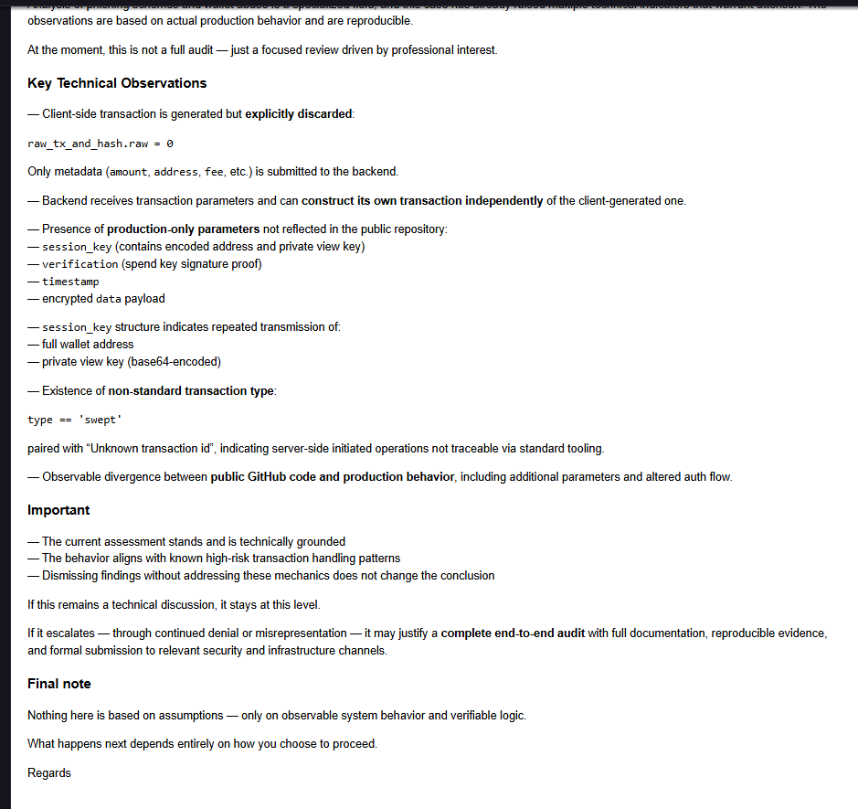
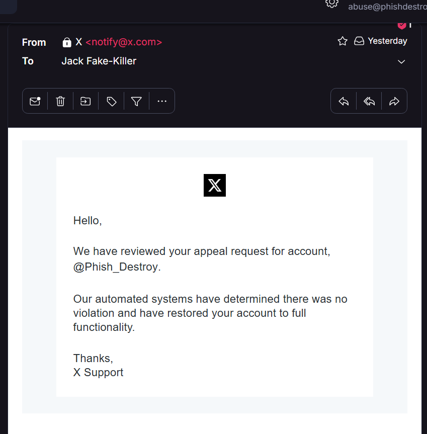
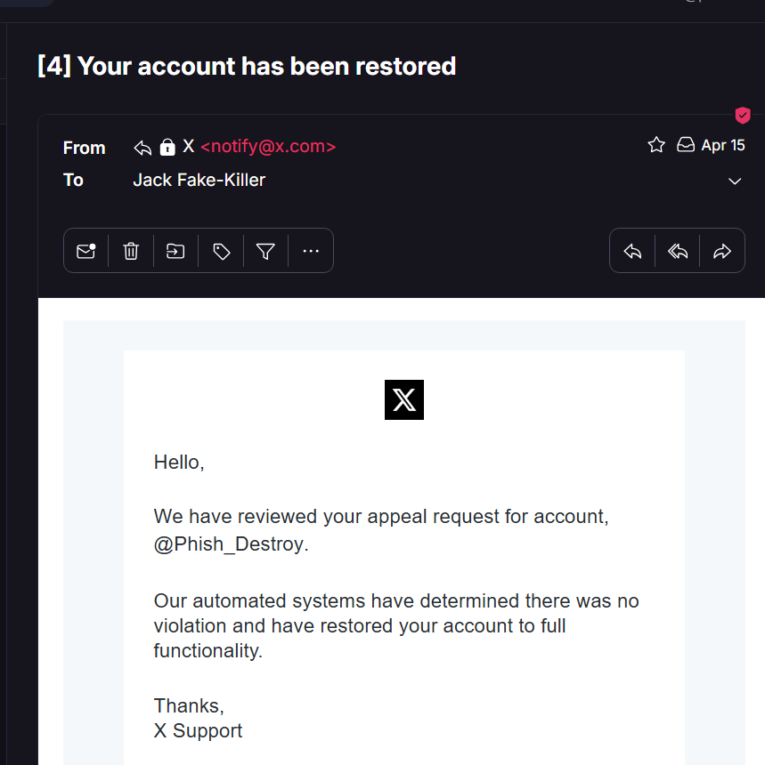
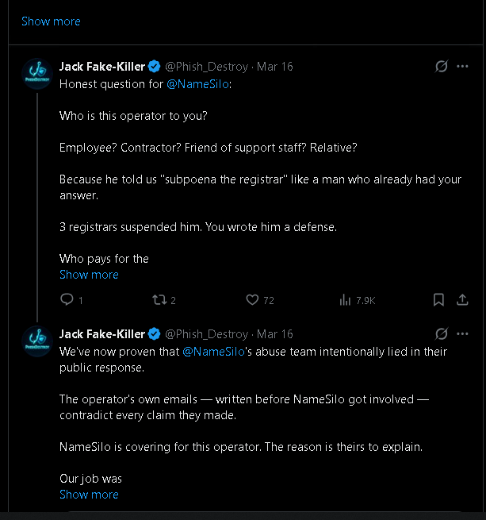

<!--
NameSilo, LLC (IANA #1479) / xmrwallet — public evidence repository
Canonical: https://phishdestroy.io/namesilo-xmrwallet-coverup
SEO topics: namesilo, xmrwallet, monero-drainer, crypto-scam, registrar-abuse, icann-compliance, phishdestroy
-->

<div align="center">

# NameSilo, LLC (IANA #1479) Is Protecting `xmrwallet[.]com`

### A US ICANN-accredited registrar publicly defended a 10-year, $20M Monero drainer — and is still actively trying to erase the evidence.

**[Master proof index &rarr;](PROOFS.md)** &nbsp;·&nbsp; **[Full article &rarr;](ARTICLE_FULL.md)** &nbsp;·&nbsp; **[The Connection &rarr;](CONNECTION.md)** &nbsp;·&nbsp; **[The Lies &rarr;](THE-LIES.md)** &nbsp;·&nbsp; **[Pressure Campaign &rarr;](PRESSURE.md)** &nbsp;·&nbsp; **[Technical breakdown &rarr;](SCAM_TECHNICAL.md)** &nbsp;·&nbsp; **[Operator dossier &rarr;](OPERATOR_PROFILE.md)** &nbsp;·&nbsp; **[Victims &amp; timeline &rarr;](VICTIMS.md)** &nbsp;·&nbsp; **[Evidence Index &rarr;](EVIDENCE_INDEX.md)**

[](LICENSE)
[](EVIDENCE_HASHES.txt)
[](docs/)
[](https://phishdestroy.io)

</div>

---

> **A note on what you're reading and why we were ready.**
>
> We knew the operator's playbook before NameSilo, LLC (IANA #1479) ever opened their mouth. We'd been watching since 2016. We'd seen him delete real victim reviews off Trustpilot. We'd seen the fake DMCAs on GitHub. We'd seen the puppet Twitter accounts mass-reporting researchers. We'd seen the 50+ paid SEO articles burying the complaints. We'd seen him scrub BitcoinTalk threads, nuke YouTube videos, wipe Reddit posts. Eight years of the same pattern: never answer the evidence, just make the person who published it disappear.
>
> So when NameSilo, LLC (IANA #1479) posted their official defense of him — four sentences, four lies, on a public channel, from a verified corporate account — we didn't panic. We archived it. Instantly. GhostArchive, Wayback, local capture, SHA-256 hash. Before they could blink. Because we already knew this registrar was going to do exactly what the scammer always does: try to erase the receipts. They did. On schedule. With their paid Gold Checkmark support channel on X.
>
> They think they're clever. They're not. They're predictable. Every move they've made, we anticipated. Every surface they've taken down, we'd already mirrored. Every complaint they've filed, we've logged. They operate like the evidence will eventually go away. It won't.
>
> One more thing: **the $10M-$20M number is a floor, not a ceiling.** Eight years, thousands of wallets, operator-side key exfiltration on every single login — the real number is significantly higher. We use the conservative estimate because we only publish what we can prove. But we know. And the on-chain analysis, when it's complete, is going to make this README look like the opening statement.
>
> And to NameSilo, LLC (IANA #1479): you publicly committed — in writing, from your official account — to helping a confirmed scammer get his VirusTotal detections removed. **You said that. Out loud. On the internet. While the drainer was still live.** You really thought nobody would keep the receipt?
>
> **Let's get one thing straight.** This is not a cry for help. We don't need sympathy, petitions, or outrage. We are not victims here — the people who lost their Monero on `xmrwallet[.]com` are. We are researchers. We document. We publish. We archive. That's what we do.
>
> What you are looking at is a **flat evidence file**. Screenshots. Emails. Timestamps. Hashes. Every claim sourced, every exhibit fingerprinted, every lie cross-referenced against the liar's own words.
>
> NameSilo, LLC (IANA #1479) and the operator have spent **eight years** pressing the "report" button on every platform that hosts the truth about them. They deleted GitHub issues. They mass-reported victim reviews. They filed fake DMCAs. They got our Twitter locked. They're trying to delist us from Bing right now. **They have never — not once, in eight years — produced a single technical rebuttal.** Not one line of code. Not one network capture. Not one counter-argument. Just the report button, over and over, on every surface they can reach.
>
> That is not the behavior of people who have been falsely accused. That is the behavior of people who know exactly what they did and have no answer except to make the evidence disappear.
>
> **It's not disappearing.** This repo is mirrored, hashed, archived, pinned to IPFS, and spread across jurisdictions they'd need a dozen separate legal actions to touch. Every takedown attempt gets logged as another entry in [`PRESSURE.md`](PRESSURE.md). Every deleted review gets noted in [`VICTIMS.md`](VICTIMS.md). Every fake DMCA gets documented in [`SECURITY.md`](SECURITY.md).
>
> They're not erasing anything. They're building our case for us.

---

## What this repository is

This is the immutable, court-usable case file for what NameSilo, LLC (IANA #1479) did when caught defending a Monero theft operation that has been live for roughly **ten years** and stolen an estimated **$10M-$20M** in user funds.

NameSilo, LLC (IANA #1479) did not ignore our reports — that would be ordinary registrar negligence. NameSilo, LLC (IANA #1479) went **publicly on the record** to call the operator "the victim," to deny ever receiving any of our 20+ delivery-receipted abuse reports, and to commit — in writing, on Twitter — to **helping the operator scrub his security detections from VirusTotal**.

When we proved every sentence of that statement was false, the takedown started.

> **Our research account was locked. Our domain has been targeted with Bing delisting attempts. They are still lying. They are still trying to erase this story.**
>
> So this repository exists. Mirrored. Hashed. Permanently archived. Not deletable.

---

## Exhibit A — NameSilo's lie, in their own words

This is NameSilo's official corporate tweet of **March 13, 2026** — published under our investigation thread, defending a confirmed $20M crypto drainer. Four sentences. Four lies. Permanently archived: [ghostarchive.org/archive/CXXZ0](https://ghostarchive.org/archive/CXXZ0)

<div align="center">


*NameSilo, LLC (IANA #1479) (@namesilo), replying to @Phish_Destroy — March 13, 2026. 11K views. They chose to put this in public. It stays in public.*

</div>

We confronted them **the day before** this tweet: *"9 reports is no joke anymore."* Their response was not to act on the reports — it was to publicly defend the scammer. Two days later, we called it what it was:

<div align="center">



*@Phish_Destroy, March 16, 2026 — "NameSilo, LLC (IANA #1479) is acting as press secretary for a $2M+ Monero theft operation." These tweets are now invisible because the account was locked.*

</div>

---

## Exhibit B — The operator's own email, proving NameSilo, LLC (IANA #1479) lied

The operator wrote to us **first** — February 16, 2026, from `royn5094@protonmail.com`. He defended the site as his own work. He never claimed a hack. This email alone destroys NameSilo's "domain was compromised" narrative.

<div align="center">



*The operator, in his own words: "There is no phishing going on with xmrwallet.com." He never claimed a hack. NameSilo, LLC (IANA #1479) invented the "compromise" story 25 days later.*

</div>

We replied the same day with a complete technical breakdown — 8 PHP endpoints, `session_key` exfiltration, `raw_tx_and_hash.raw = 0` — and an explicit warning:

<div align="center">



*"What happens next depends entirely on how you choose to proceed." — PhishDestroy, Feb 16. He chose to keep lying. His registrar chose to help.*

</div>

---

## Exhibit C — They silenced us. X cleared us. The lock stayed.

After we posted the receipts publicly and escalated to ICANN, our account was permanently locked. X's own automation reviewed the appeal and wrote back **in writing**:

<div align="center">

<table><tr>
<td width="50%">



</td>
<td width="50%">



</td>
</tr></table>

*X Support, April 15, 2026: "No violation. Restored to full functionality." The account is **still locked.** The Gold subscription is **still being billed.** A human agent at X — accessible via NameSilo's paid Gold Checkmark support channel — overrode the machine.*

</div>

**Concierge censorship that you can buy.** Full breakdown: [`PRESSURE.md`](PRESSURE.md)

---

## Exhibit D — The question they never answered

<div align="center">



*"Who is this operator to you?" — @Phish_Destroy, March 16. 72 likes, 7.9K views. Never answered. Then our account was locked.*

</div>

---

## The connection — in one paragraph

A scammer running a ten-year crypto drainer, on $550-a-month bulletproof hosting in Belize, behind Russian DDoS-Guard, wrote to us on **February 17, 2026**: *"Feel free to subpoena the domain registrar for my information."* Twenty-four days later, on **March 13, 2026**, that same registrar — **NameSilo, LLC (IANA #1479)** — published an official tweet calling him **"the victim"** of a hypothetical hack, denying our 20+ abuse reports ever arrived, and announcing a public commitment to **clean up his VirusTotal detections**. Three other registrars (PDR, WebNic, NICENIC) holding the same domain looked at the same evidence and **suspended in days**. NameSilo, LLC (IANA #1479) wrote a press release for him. **They put the connection in public themselves.** This repository is the receipts.

> Full evidence chain: [`CONNECTION.md`](CONNECTION.md)

---

## The lies — in one table

| NameSilo's claim | Reality | Verdict |
|---|---|---|
| "Domain was compromised a few months ago." | The theft code *is* the website. 8 PHP endpoints, server-side `session_key` exfiltration, `raw_tx_and_hash.raw = 0`. Built to steal from day one, ~10 years. The operator **never claimed a hack** in his own emails. | **FALSE** |
| "Prior to that, we had received no abuse reports." | **20+ delivery-receipted abuse reports** through their own portal, 2023-2026. Our tweet from **one day before** their statement says "9 reports is no joke anymore." | **FALSE** |
| "After an extensive review... not involving the registrant." | The operator wrote to **us** defending his code as his own. NameSilo, LLC (IANA #1479) adopted a "compromise" framing the operator himself never advanced. | **FALSE** |
| "Working with the registrant to remove the website from VT reports." | A registrar helping a confirmed scammer erase his security warnings from 6+ authoritative vendors. Not abuse handling. **Active obstruction of consumer-protection telemetry.** | **DAMNING** |

> Full line-by-line breakdown: [`THE-LIES.md`](THE-LIES.md)

---

## The pressure campaign — what they're still doing right now

The moment we replied with the operator's own emails, the silencing started. **They have not stopped.**

| Date | What happened | Status |
|---|---|---|
| 2026-03-13 | NameSilo, LLC (IANA #1479) publishes the four-lie defense | [Archived forever](https://ghostarchive.org/archive/CXXZ0) |
| 2026-03-16 | We post the receipts — "@NameSilo is lying" | Tweets now invisible (account locked) |
| 2026-03-18 | We escalate to ICANN + law enforcement | On record |
| 2026-03-?? | **@Phish_Destroy permanently locked** via Gold Checkmark live-support | **Still locked** |
| 2026-04-15 | X automation: *"no violation, restored"* | **Lock not lifted. Gold still billed.** |
| Ongoing | **Bing search delisting** of `phishdestroy.io` | Tracking |
| Ongoing | **DDoS** from "njan la" reseller infrastructure | Mitigated |
| 8 years | Operator: fake DMCA, mass-report reviews, delete GitHub issues, 50+ paid SEO articles to bury victims | [Documented](OPERATOR_PROFILE.md) |

> Full timeline: [`PRESSURE.md`](PRESSURE.md) &middot; Operator's 8-year suppression history: [`OPERATOR_PROFILE.md`](OPERATOR_PROFILE.md)

---

## What's in this repository

```
.
├── README.md                  <- you are here (landing page with key evidence)
├── PROOFS.md                  <- MASTER INDEX: every piece of evidence, every mirror
├── ARTICLE_FULL.md            <- full long-form article (mirror of Medium / phishdestroy.io)
├── CONNECTION.md              <- evidence chain: NameSilo, LLC (IANA #1479) <-> xmrwallet operator
├── THE-LIES.md                <- line-by-line debunking of NameSilo's March 13 statement
├── PRESSURE.md                <- silencing attempts, dated, still-ongoing
├── SCAM_TECHNICAL.md          <- full technical investigation (viewkey x40/session, 8 endpoints, IOCs)
├── XMRWALLET_TECHNICAL.md     <- server-side key drainer summary (case-file format)
├── OPERATOR_PROFILE.md        <- complete operator dossier (identity, domains, IPs, victims, IOCs)
├── VICTIMS.md                 <- documented victims, full 2016-2026 timeline, scoreboard
├── EVIDENCE_INDEX.md          <- every screenshot, indexed, with section + date + sha256
├── MEDIUM_MIRROR.md           <- all Medium articles + pre-formed Wayback save URLs
├── TWITTER_ARCHIVE.md         <- @Phish_Destroy archive methodology & tooling
├── SOURCES.md                 <- permanent archive URLs for every external claim
├── EVIDENCE_HASHES.txt        <- SHA-256 of every screenshot (verify with sha256sum -c)
├── LICENSE                    <- CC-BY-4.0 + explicit grant for legal/regulatory use
├── SECURITY.md                <- how victims and researchers can report
├── CITATION.cff               <- machine-readable citation for academic / legal use
├── DEPLOY.md                  <- push + IPFS/Arweave pinning + mass archive submission
├── .github/ISSUE_TEMPLATE/    <- templates for victim reports and additional evidence
├── evidence/                  <- 10 screenshots, descriptive filenames, SHA-256 verified
├── tools/                     <- reproducible Twitter archive tooling (Wayback / archive.ph / DDG)
└── docs/                      <- GitHub Pages mirror — fully SEO-optimized static site
```

> **Where do I start?** Open [`PROOFS.md`](PROOFS.md) — every piece of evidence and every mirror in one place. That is the file to share if you only have one URL.

---

## Verify the evidence yourself

Every screenshot in `evidence/` has a SHA-256 fingerprint in [`EVIDENCE_HASHES.txt`](EVIDENCE_HASHES.txt). To check that nothing has been tampered with:

```bash
git clone https://github.com/phishdestroy/namesilo-xmrwallet-coverup.git
cd namesilo-xmrwallet-coverup/evidence
sha256sum -c ../EVIDENCE_HASHES.txt
```

All 10 files should report `OK`. If any fails, do not trust the modified copy — open an Issue and we will investigate.

---

## For victims of `xmrwallet[.]com`

If you have lost funds to `xmrwallet[.]com`, this repository is a **ready-made evidence package** you can attach to:

- A police report (in any jurisdiction)
- An IC3 (FBI) cybercrime complaint — https://www.ic3.gov
- A FTC complaint — https://reportfraud.ftc.gov
- An ICANN Contractual Compliance complaint against NameSilo, LLC (IANA #1479) — https://www.icann.org/compliance
- A civil claim against NameSilo, LLC (IANA #1479) and/or the operator
- A chargeback / insurance filing

The license file in this repo ([`LICENSE`](LICENSE)) is **explicit, written consent** to use this evidence as-is in any of the above. No further authorization required from PhishDestroy.

Direct contact for victims: **[report@phishdestroy.io](mailto:report@phishdestroy.io)**

> Open an Issue using the [Victim Report template](.github/ISSUE_TEMPLATE/victim-report.yml) if you want your case added to the public ledger.
>
> Documented victims and the full 2016-2026 timeline: [`VICTIMS.md`](VICTIMS.md)

---

## For ICANN compliance officers, regulators, journalists

The full case file was forwarded to **ICANN Contractual Compliance on March 18, 2026**. This repository is the public mirror of that filing, with the same screenshots, the same hashes, and the same explicit consent for republication.

If you need additional materials (raw email headers, server-side capture of the eight `xmrwallet[.]com` PHP endpoints, the 20+ historical abuse-report delivery receipts to NameSilo, LLC (IANA #1479) dating back to 2023), contact **[abuse@phishdestroy.io](mailto:abuse@phishdestroy.io)** with a subject line that identifies your role.

---

## Why this matters beyond one domain

NameSilo, LLC (IANA #1479) is tied — in our records — to **hundreds of active crypto-scam domains targeting US users**. Across two years of work we have submitted thousands of abuse reports through their portal. The pattern, consistently, is silence.

`xmrwallet[.]com` is the case where they broke their silence. They went on the record. They put a defense of a confirmed scammer in their own corporate voice, on a public channel, with an offer to help him erase his security record.

This is not a single registrar making a single review error. **This is a registrar publishing a corporate policy of protecting a specific operator** — and using paid platform-level access (X Gold Checkmark live support) to silence the people who proved them wrong.

If a registrar can do this once, in public, and walk it off — every other registrar learns the lesson.

So this case is not going to walk off.

---

## Mirrors

This story is being kept alive in multiple places, intentionally:

- **Canonical:** [phishdestroy.io/namesilo-killed-our-twitter](https://phishdestroy.io/namesilo-killed-our-twitter)
- **Medium:** [phishdestroy.medium.com/namesilo-lied-to-defend-a-20m-crypto-scam](https://phishdestroy.medium.com/namesilo-lied-to-defend-a-20m-crypto-scam-then-took-down-our-twitter-4904d15d531e)
- **GitHub Pages mirror:** [`docs/index.html`](docs/index.html) (deploy via Settings -> Pages -> /docs)
- **GhostArchive (NameSilo's tweet):** [ghostarchive.org/archive/CXXZ0](https://ghostarchive.org/archive/CXXZ0)
- **GitHub evidence repo (this one):** the file you are reading right now
- **IPFS / Arweave:** CID and TX ID published after pinning (see [`DEPLOY.md`](DEPLOY.md))

> Cut down one link. Five more grow back. We run on the **Hydra principle**.

---

<div align="center">

### *Scammers delete evidence. NameSilo, LLC (IANA #1479) defended one. X locked our account. Bing is delisting us. The archive remains. The truth remains. We remain.*

**PhishDestroy Research** · [phishdestroy.io](https://phishdestroy.io) · [abuse@phishdestroy.io](mailto:abuse@phishdestroy.io)

</div>
